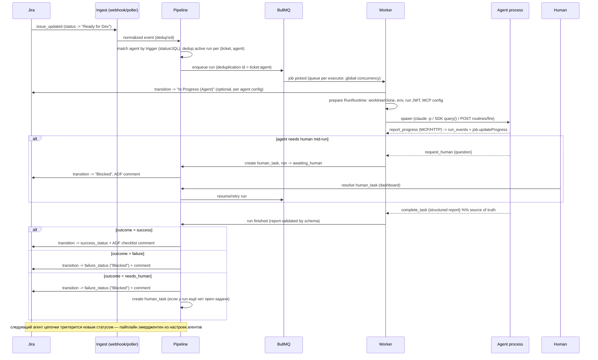

# BRIGADIR — Архитектура

Оркестратор пайплайнов AI-кодинг-агентов поверх Jira. Self-hosted-first, позже multi-tenant SaaS.

Базовые решения (зафиксированы): NestJS + Vue.js; Redis + BullMQ (только очереди); **Postgres — источник правды** по истории прогонов, чеклистам, логам и human-tasks; **Jira — источник правды по статусу тикета**; Jira webhooks для скорости + reconciliation-поллинг как гарантия.

---

## 1. Компоненты

```
                            ┌─────────────────────────────────────────────┐
                            │                 Jira Cloud                  │
                            │  (source of truth: ticket status)           │
                            └───────┬─────────────────────▲───────────────┘
                     webhooks /     │                     │  transitions, ADF comments,
                     JQL polling    │                     │  issue properties (per-issue write queue)
                            ┌───────▼─────────────────────┴───────────────┐
                            │              NestJS Backend                 │
                            │                                             │
   Vue.js Dashboard ◄──SSE──┤  JiraModule      ── client, rate-limiter,   │
   (checklists, runs,       │                     transition discovery,   │
    human-task queue)──REST─►                     ADF composer            │
                            │  IngestModule    ── webhook endpoint,       │
                            │                     reconciliation poller   │
                            │  PipelineModule  ── ticket state machine,   │
                            │                     agent matching, dedup   │
                            │  RunModule       ── run lifecycle, events,  │
                            │                     checks, reports         │
                            │  CallbackModule  ── HTTP callback API +     │
                            │                     Streamable HTTP MCP     │
                            │  HumanTaskModule ── human queue             │
                            │  ExecutorModule  ── AgentExecutor registry  │
                            └───────┬───────────────────▲─────────────────┘
                                    │ enqueue           │ complete_task /
                            ┌───────▼───────┐           │ report_progress /
                            │ Redis + BullMQ│           │ request_human
                            │ queue per     │           │
                            │ executor type │           │
                            └───────┬───────┘           │
                            ┌───────▼───────────────────┴─────────────────┐
                            │            Worker (NestJS WorkerHost)       │
                            │  RunRuntime (process │ docker/runsc │ SaaS  │
                            │  sandbox) + git worktree + secret broker    │
                            │        ┌──────────────────────────┐         │
                            │        │  Agent process:          │         │
                            │        │  claude -p / Agent SDK / │         │
                            │        │  OpenAI-compatible loop /│         │
                            │        │  Routines /fire (remote) │         │
                            │        │  + brigadir MCP tools    │         │
                            │        └──────────────────────────┘         │
                            └─────────────────────────────────────────────┘
```

Модули backend'а:

| Модуль | Ответственность |
|---|---|
| `JiraModule` | REST-клиент (v3), per-tenant rate-limiter (token bucket, 429 + `Retry-After`), **per-issue write queue** (лимит 20 записей/2 c), runtime transition discovery с кэшем и 409-ретраем, ADF-composer чеклистов, issue properties |
| `IngestModule` | `POST /webhooks/jira` (HMAC, дедуп по `X-Atlassian-Webhook-Identifier`), reconciliation-поллер (`/rest/api/3/search/jql`, `nextPageToken`, high-water mark по `updated`), webhook-refresh-крон (для 3LO-фазы) |
| `PipelineModule` | Машина состояний тикета: событие «тикет вошёл в trigger-статус агента» → дедуп → enqueue run; по `complete_task` → transition в success/failure-статус или Blocked + human task |
| `RunModule` | CRUD прогонов, таймлайн событий, чеклисты, стоимость/usage, retry/cancel |
| `CallbackModule` | Приём callback'ов от агентов: HTTP API + Streamable HTTP MCP endpoint; валидация per-run JWT |
| `ExecutorModule` | Реестр `AgentExecutor`, конфигурация, health-checks, backpressure |
| `HumanTaskModule` | Очередь «нужен человек»: создание из `request_human`/`complete_task`, резолюция → продолжение/ретрай пайплайна |

---

## 2. Диаграмма пайплайна тикета



Принципы:

1. **Пайплайн не описывается явно** — он эмерджентен: каждый агент подписан на trigger-статус/JQL и переводит тикет в целевой статус; цепочка статусов на доске и есть пайплайн. (Плюс: полная совместимость с ручным вмешательством через Jira.)
2. **Jira — источник правды по статусу**: оркестратор никогда не «считает» тикет находящимся в статусе, которого не видел в Jira; наше `tickets.last_seen_status` — кэш для diff'а, не правда.
3. **Идемпотентность на трёх уровнях**: дедуп webhook-событий (identifier), BullMQ `deduplication: {id}`, partial unique index в Postgres на активный прогон (ticket, agent).
4. **Завершение прогона = получение `complete_task`**. Единственное исключение — blocking `request_human`: он сам переводит run в `awaiting_human`, после чего процесс легитимно завершается без `complete_task` (Stop-hook это учитывает, см. §5). Любой другой выход процесса без `complete_task` = `failed` c диагностикой из exit JSON. Stop-hook (для Claude-executor'ов) принуждает агента вызвать тулзу.

---

## 3. Схема данных (Postgres)

```sql
-- ============ workspace & configuration ============

CREATE TABLE workspaces (
  id              uuid PRIMARY KEY DEFAULT gen_random_uuid(),
  name            text NOT NULL,
  jira_site_url   text NOT NULL,               -- https://acme.atlassian.net
  jira_project_key text NOT NULL,              -- BRIG
  jira_board_id   int,                         -- миграция итерации 2: привязка к борде
  jira_board_type text,                        -- kanban | scrum (определяется через Agile API при подключении)
                                               -- scrum => скоуп поллера = активный спринт (см. spec 0.3 и plan-internal п.5)
  jira_auth_type  text NOT NULL DEFAULT 'api_token',  -- api_token (решение 2026-07-10: основной способ; oauth_3lo — резерв полной продуктовой версии)
  jira_credentials bytea NOT NULL,             -- encrypted (AES-256-GCM, key from env/KMS)
  jira_credential_expires_at timestamptz,      -- API token <= 1 year: alerting!
  settings        jsonb NOT NULL DEFAULT '{}', -- repositories[] (первый — дефолтный), scope_jql,
                                               -- branch_prefix (дефолт для агентов), active_sprint_id,
                                               -- high-water mark поллера, git credentials ref
  created_at      timestamptz NOT NULL DEFAULT now(),
  updated_at      timestamptz NOT NULL DEFAULT now()
);

-- ИМЕНОВАННЫЙ ПРОФИЛЬ РАННЕРА (2026-07-14; PLATFORM-scoped с миграции 0003,
-- решение 2026-07-13): executor — рантайм-профиль на всю платформу: транспорт
-- (type — реестр в коде, строки не создают поведения) + модель + лимиты +
-- опциональные креды. Агент — чистая роль, привязан к профилю через
-- agents.executor_id; модель агента НЕ принадлежит (legacy behavior.model
-- игнорируется рантаймом безусловно). Очередь run.<type> и суммарная
-- concurrency воркера и так были глобальными.
CREATE TABLE executors (
  id              uuid PRIMARY KEY DEFAULT gen_random_uuid(),
  type            text NOT NULL,               -- claude_routines | claude_cli | anthropic_api | deepseek_api
  name            text NOT NULL,               -- алиас профиля («команда/владелец раннера»), глобально уникален
  config          jsonb NOT NULL DEFAULT '{}', -- non-secret свойства ПРОФИЛЯ: model, max_turns, cli path, routine_id...
                                               -- (repository здесь БОЛЬШЕ НЕ живёт: берётся из agents.behavior.repository,
                                               --  иначе дефолтный репозиторий workspace прогона; leftover-ключ игнорируется)
  secrets         bytea,                       -- опциональный API-ключ профиля: JSON {api_key}, запечатан тем же
                                               -- AES-256-GCM конвертом, что jira_credentials (ключ BRIGADIR_CREDENTIALS_KEY).
                                               -- WRITE-ONLY через API (в ответах только has_api_key); ключ задан →
                                               -- рантайм инжектит ANTHROPIC_API_KEY в спаун (биллинг по ключу),
                                               -- нет → подписка хоста
  max_parallel_runs int NOT NULL DEFAULT 2,    -- кап ОДНОВРЕМЕННЫХ прогонов ЭТОГО профиля (processor-side gate
                                               -- считает running-прогоны по executor_id); concurrency воркера типа =
                                               -- СУММА по enabled-профилям (type capacity, boot + 15s re-apply)
  enabled         boolean NOT NULL DEFAULT true, -- false → исключён из type capacity, его джобы держит gate
  UNIQUE (name)
);

CREATE TABLE agents (
  id              uuid PRIMARY KEY DEFAULT gen_random_uuid(),
  workspace_id    uuid NOT NULL REFERENCES workspaces(id) ON DELETE CASCADE,
  executor_id     uuid NOT NULL REFERENCES executors(id),
  name            text NOT NULL,               -- "Implementer", "QA Agent"
  description     text,                        -- feature 010: roster line показывается оркестратору в handoff (nullable)
  instruction     text NOT NULL,               -- user prompt (без обёртки)
  is_orchestrator boolean NOT NULL DEFAULT false, -- feature 010: пер-workspace оркестратор "brigadir" (никогда не poll-триггерится, неудаляем, исключён из routing-таргетов; в resume-пикере ПРИСУТСТВУЕТ и преселектнут по умолчанию — answer-triage delta: резолв на него создаёт answer-triage run)
  trigger_status  text,                        -- Jira status name, ИЛИ:
  trigger_jql     text,                        -- дополнительный JQL-фильтр (AND)
  status_running  text,                        -- optional: куда перевести на время работы
  status_success  text NOT NULL,               -- у оркестратора — инертный placeholder (см. FR-007): completed-run оркестратора не делает generic transition
  status_failure  text NOT NULL,               -- обычно "Blocked"
  behavior        jsonb NOT NULL DEFAULT '{}', -- behavior options (см. §7); у оркестратора { workspace_mode: 'none' } → no-repo run
  timeout_minutes int NOT NULL DEFAULT 45,
  max_budget_usd  numeric(8,2),
  max_attempts    int NOT NULL DEFAULT 2,
  enabled         boolean NOT NULL DEFAULT true,
  UNIQUE (workspace_id, name)                  -- гарантирует один "brigadir" на workspace (seed insert-if-absent)
);

-- ============ global_settings (feature 010) ============
-- Платформенный key-value store (без workspace FK) под секцию "General".
-- Первый ключ: default_orchestrator_instruction (JSON-строка), копируется в
-- инструкцию сидируемого оркестратора при СОЗДАНИИ workspace (изменение влияет
-- только на созданные позже — SC-006). Delete-guard оркестратора — в API
-- (agents.controller → 409), не в БД, чтобы правки instruction/enabled работали.
CREATE TABLE global_settings (
  key             text PRIMARY KEY,
  value           jsonb NOT NULL,
  updated_at      timestamptz NOT NULL DEFAULT now()
);

-- ============ tickets & runs ============

CREATE TABLE tickets (
  id              uuid PRIMARY KEY DEFAULT gen_random_uuid(),
  workspace_id    uuid NOT NULL REFERENCES workspaces(id) ON DELETE CASCADE,
  jira_key        text NOT NULL,               -- BRIG-123
  jira_id         text NOT NULL,
  summary         text,
  last_seen_status text,                       -- кэш для diff, НЕ источник правды
  last_seen_updated timestamptz,               -- кэш updated тикета; high-water mark поллера живёт в workspaces.settings
  UNIQUE (workspace_id, jira_key)
);

CREATE TABLE runs (
  id              uuid PRIMARY KEY DEFAULT gen_random_uuid(),
  workspace_id    uuid NOT NULL REFERENCES workspaces(id),
  ticket_id       uuid REFERENCES tickets(id),  -- NULL: бестикетный workspace-setup прогон (feature 011)
  agent_id        uuid NOT NULL REFERENCES agents(id),
  executor_type   text NOT NULL,
  status          text NOT NULL DEFAULT 'queued',
    -- queued | running | awaiting_human | succeeded | failed | cancelled | timed_out | superseded
    -- superseded: закрыт resume'ом human-task (на его месте создан новый attempt, см. spec 1.4)
  attempt         int NOT NULL DEFAULT 1,
  trigger_event   jsonb,                       -- что запустило: manual|webhook|poll|human-resume|triage|rework|answer-triage|workspace-setup (feature 010 + answer-triage delta + feature 011); handoff-поля failing_run_id/deciding_run_id/human_task_id/target_agent/task ездят здесь же
  external_ref    text,                        -- claude session_id / routines session_url
  worktree_path   text,
  started_at      timestamptz,
  finished_at     timestamptz,
  exit_code       int,
  cost_usd        numeric(10,4),
  usage           jsonb,                       -- tokens, cache hit rate
  error           text,
  report          jsonb,                       -- полный structured report (см. §6)
  outcome         text,                        -- success | failure | needs_human (из report)
  created_at      timestamptz NOT NULL DEFAULT now()
);
-- третий рубеж идемпотентности: один активный прогон на (ticket, agent)
CREATE UNIQUE INDEX runs_one_active ON runs (ticket_id, agent_id)
  WHERE status IN ('queued', 'running', 'awaiting_human');
-- feature 011: NULL'ы в unique-индексе различны, поэтому бестикетные прогоны
-- охраняет парный индекс — максимум ОДИН активный setup-прогон на workspace
CREATE UNIQUE INDEX runs_one_active_setup ON runs (workspace_id)
  WHERE status IN ('queued', 'running', 'awaiting_human') AND ticket_id IS NULL;
CREATE INDEX runs_ticket ON runs (ticket_id, created_at DESC);

CREATE TABLE run_checks (                       -- чеклист UI строится отсюда
  id              uuid PRIMARY KEY DEFAULT gen_random_uuid(),
  run_id          uuid NOT NULL REFERENCES runs(id) ON DELETE CASCADE,
  position        int NOT NULL,
  name            text NOT NULL,
  status          text NOT NULL,               -- pass | fail | skip | warn
  reason          text
);

CREATE TABLE run_events (                       -- таймлайн прогона
  id              bigint GENERATED ALWAYS AS IDENTITY PRIMARY KEY,
  run_id          uuid NOT NULL REFERENCES runs(id) ON DELETE CASCADE,
  type            text NOT NULL,               -- progress | log | tool_call | api_retry | error | jira_action
  payload         jsonb NOT NULL,
  created_at      timestamptz NOT NULL DEFAULT now()
);
CREATE INDEX run_events_run ON run_events (run_id, id);

-- ============ human queue ============

CREATE TABLE human_tasks (
  id              uuid PRIMARY KEY DEFAULT gen_random_uuid(),
  workspace_id    uuid NOT NULL REFERENCES workspaces(id),
  run_id          uuid REFERENCES runs(id),
  ticket_id       uuid REFERENCES tickets(id),  -- NULL: задача setup-прогона (review/failure/question, feature 011)
  kind            text NOT NULL,               -- question | blocker | review
  title           text NOT NULL,               -- короткая формулировка для человека
  details         text,
  blocking        boolean NOT NULL DEFAULT true, -- true: run ждёт (awaiting_human)
  status          text NOT NULL DEFAULT 'open',  -- open | resolved | dismissed
  resolution      text,                        -- ответ человека (передаётся агенту при resume)
  created_at      timestamptz NOT NULL DEFAULT now(),
  resolved_at     timestamptz,
  resolved_by     text
);
CREATE INDEX human_tasks_open ON human_tasks (workspace_id, status) WHERE status = 'open';

-- ============ ingest idempotency ============

CREATE TABLE webhook_events (
  id              uuid PRIMARY KEY DEFAULT gen_random_uuid(),
  workspace_id    uuid NOT NULL REFERENCES workspaces(id),
  external_id     text NOT NULL,               -- X-Atlassian-Webhook-Identifier
  event_type      text NOT NULL,
  payload         jsonb NOT NULL,
  processed_at    timestamptz,
  created_at      timestamptz NOT NULL DEFAULT now(),
  UNIQUE (workspace_id, external_id)
);

-- Phase 3+: users, workspace_members, api_keys, audit_log, runner_nodes
```

Redis — только очереди BullMQ (`queue:claude_cli`, `queue:anthropic_api`, `queue:deepseek_api`, `queue:claude_routines`, `queue:reconcile`) + флаги отмены `run:{id}:cancelled`. Per-issue write queue Jira — in-process (`p-queue` по issue key), не BullMQ: OSS-версия per-key сериализацию из коробки не даёт.

---

## 4. Абстракция AgentExecutor

```ts
// Один контракт, четыре реализации. Executor НЕ знает про Jira и BullMQ —
// он получает подготовленный RunContext и обязан доставлять callbacks.

export interface RunContext {
  runId: string;
  ticket: { key: string; summary: string; description: string; url: string };
  instruction: string;            // уже обёрнутая (см. §7)
  workspaceDir: string | null;    // worktree; null для remote executors (Routines)
  callback: {
    httpBaseUrl: string;          // https://brigadir.local/api/callbacks
    runToken: string;             // short-lived JWT {runId, ticketKey, exp}
    mcpStdioCmd?: string[];       // как поднять stdio-сервер (для CLI executors)
  };
  limits: { timeoutMs: number; maxBudgetUsd?: number; maxTurns?: number };
  env: Record<string, string>;    // sanitized! никакого ANTHROPIC_API_KEY из окружения хоста
}

export interface ExecutorResult {
  // Итог ПРОЦЕССА, не отчёта: отчёт приходит через CallbackModule.
  exitStatus: 'completed' | 'crashed' | 'timeout' | 'rate_limited' | 'cancelled';
  externalRef?: string;           // session_id / session_url
  costUsd?: number;
  usage?: unknown;
  diagnostics?: string;           // stderr tail / exit JSON
}

export interface AgentExecutor {
  readonly type: 'claude_cli' | 'anthropic_api' | 'deepseek_api' | 'claude_routines';
  /** Полный жизненный цикл одного прогона. Резолвится по завершении процесса/сессии. */
  run(ctx: RunContext, signal: AbortSignal): Promise<ExecutorResult>;
  /** Проверка конфигурации (auth жив, CLI установлен, routine отвечает). */
  healthCheck(): Promise<{ ok: boolean; detail?: string }>;
}
```

### Реализации

| | `claude_cli` | `anthropic_api` | `deepseek_api` | `claude_routines` |
|---|---|---|---|---|
| Механика | `spawn('claude', ['-p', ...])`, `detached: true`, kill process group | Agent SDK `query()` in-process | Agent SDK c `ANTHROPIC_BASE_URL=https://api.deepseek.com/anthropic` (план A; спайк Phase 2: endpoint не поддерживает `cache_control`, который шлёт SDK — проверить, деградирует ли молча на автокэш DeepSeek или падает) или свой OpenAI-loop (план B) | `POST /v1/claude_code/routines/{id}/fire` |
| Auth | Подписка пользователя (login/`setup-token`); **легально только на машине пользователя** | `ANTHROPIC_API_KEY` (BYOK) | DeepSeek API key (BYOK) | Per-routine fire token |
| Structured report | MCP stdio `complete_task` + `--json-schema` как fallback | In-process SDK MCP `complete_task` + `outputFormat` fallback | Forced tool call `complete_task` + repair-loop | HTTP callback `complete_task` (URL+токен в тексте триггера/промпте routine) |
| Rate-limit сигнал | stream-json `system/api_retry {error:"rate_limit"}` | SDK message stream / 429 headers | 429 (конкурентность) | 429 + `Retry-After` на `/fire` |
| Результат процесса | exit + result JSON | `SDKResultMessage` | финальный message | **fire-and-forget**: завершение = только callback или таймаут |
| Особенности | `--strict-mcp-config`, env-санация (API-ключ перебивает подписку!) | `permissionMode:'dontAsk'`, `allowedTools` | policy-деградация: no-vision routing, недоверие self-report, строгие tool-схемы (beta strict) | обязателен заголовок `anthropic-beta: experimental-cc-routine-2026-04-01`; `text` ≤ 65 536; дедуп на нашей стороне (нет idempotency key); нет отмены; watchdog-таймаут; **привязка к личному аккаунту claude.ai** — действия в Jira/git от имени владельца routine, дневной cap на запуски |

Примечание к `claude_routines`: поскольку `/fire` принимает только текст, callback URL + run-токен вшиваются в текст триггера (`{"text": "ticket=BRIG-123 callback=https://... token=..."}`), а сохранённый промпт routine инструктирует репортить результат POST'ом. Это самый слабый канал — поэтому для Routines обязателен watchdog: нет callback'а за `timeout_minutes` → `failed`, тикет в Blocked, human task. `healthCheck()` для Routines не может проверить «routine отвечает» (read-API нет, а `/fire` создаёт реальную сессию) — только наличие/формат токена и давность последнего успешного fire. Cancel облачной сессии невозможен: run помечается `cancelled` локально, поздний `complete`-callback отсекается по статусу (409).

Маппинг `ExecutorResult.exitStatus` → `runs.status`: `completed` → по отчёту (`succeeded` / `failed` / `awaiting_human`), `crashed` → `failed` (с ретраями по backoff), `timeout` → `timed_out`, `rate_limited` → job возвращается в очередь (run остаётся активным), `cancelled` → `cancelled`.

`cost_usd`/`usage` приходят только в terminal-событии стрима CLI и потому для callback-прогонов пост-датируют финализацию (`complete_task` срабатывает до выхода процесса). Worker пишет их отдельным status-independent апдейтом по run id (`RunsService.recordCostUsage`, best-effort, вне state-machine статусов) после settle executor'а — на любом exit-пути; побеждает последняя CLI-сессия, приславшая result-событие. Чтобы result-событие вообще успело родиться, cancel-poll после **callback-финализации** (succeeded/failed) даёт процессу ограниченный grace на естественный выход (`postFinalizeGraceMs`, дефолт 30 с) вместо немедленного kill; явная отмена пользователем (`cancelled`) и парковка `awaiting_human` (процесс завис на blocking-вызове) по-прежнему убиваются сразу.

### Очереди и backpressure

- Очередь на executor-тип; `setGlobalConcurrency(executor.concurrency_limit)`.
- 429/лимит подписки → `worker.rateLimit(ttl)` + `Worker.RateLimitError()` (attempt не расходуется); ttl — из `Retry-After`/`retry_delay_ms`; для 5-часовых окон подписки момент сброса программно недоступен → эвристика (15 мин, при повторном упоре 60 мин).
- Крэш/timeout → exponential backoff + jitter, `max_attempts` из агента; невосстановимое (auth, ToS-блок) → `UnrecoverableError`.
- Reconciliation-sweeper (`upsertJobScheduler`, каждые 5 мин): (a) поллинг Jira против `last_seen_*`; (b) починка расхождений runs ↔ queue ↔ живость child-процессов; (c) webhook-refresh (3LO-фаза).

---

## 5. Протокол callback'ов (MCP + HTTP)

### Единый контракт тулз (один zod-модуль → четыре биндинга)

```ts
export const CallbackTools = {
  report_progress: z.object({
    percent: z.number().min(0).max(100).optional(),
    stage: z.string(),               // "exploring" | "implementing" | "testing" | ...
    message: z.string().max(500),
  }),
  request_human: z.object({
    kind: z.enum(['question', 'blocker', 'review']),
    title: z.string().max(120),      // короткая формулировка для очереди
    details: z.string().max(4000),
    blocking: z.boolean().default(true), // true => агент ждёт ответа (или завершает run как awaiting_human)
  }),
  complete_task: ReportSchema,       // см. §6 — финальный отчёт как аргументы тулзы
  // feature 011: read-only Jira-тулзы — «глаза, не голос». Доступны КАЖДОМУ
  // callback-wired прогону; чтения исполняет система через Jira-доступ
  // workspace'а прогона (агент кредов не видит), write-поверхности нет.
  get_project_overview: z.object({}),                 // тип борды, статусы workflow, типы задач, активный спринт
  search_tickets: z.object({                          // структурные фильтры — сырой JQL НЕ принимается,
    text: z.string().max(200).optional(),             // project-скоуп компонует сервер (побег через OR project= невозможен)
    status: z.string().max(100).optional(),
    issue_type: z.string().max(100).optional(),
    max_results: z.number().int().min(1).max(50).optional(),
  }),
  get_ticket: z.object({ key: z.string().max(50) }),  // описание + последние комментарии (≤20) + линки; ответы size-bounded с флагом truncated
};
```

Биндинги:

1. **stdio MCP** (`claude_cli`): отдельный бинарь `brigadir-mcp`; подключается через `--mcp-config {worktree}/.brigadir/mcp.json`, где значения env заданы как `${BRIGADIR_RUN_TOKEN}` и т.п. — подставляются из env процесса `claude`, который выставляет воркер. Токен не попадает ни в argv (виден в `ps`), ни в файл на диске. Каждый handler = `POST` на HTTP API ниже. stdout — только протокол, логи в stderr.
2. **In-process SDK MCP** (`anthropic_api`, `deepseek_api` план A): `createSdkMcpServer` — handlers замыкаются на run-сервисы напрямую, без HTTP и токена.
3. **OpenAI functions** (`deepseek_api` план B): те же схемы в `tools[]`, исполняет сам цикл.
4. **HTTP API / Streamable HTTP MCP** (`claude_routines`, будущие remote executors): endpoints ниже, либо `/mcp` (Streamable HTTP) с теми же тулзами.

### HTTP API callback'ов

```
POST /api/callbacks/runs/:runId/progress    Authorization: Bearer <run JWT>
POST /api/callbacks/runs/:runId/human
POST /api/callbacks/runs/:runId/complete    body = structured report
GET  /api/callbacks/runs/:runId/jira/overview          (feature 011, read-only)
POST /api/callbacks/runs/:runId/jira/search            body = структурные фильтры
GET  /api/callbacks/runs/:runId/jira/tickets/:key      403 out_of_scope вне проекта workspace'а
```

Аутентификация: **short-lived JWT per run** `{ sub: runId, wsp: workspaceId, tkt?: ticketKey (нет у бестикетных setup-прогонов, feature 011), exp = started_at + timeout + grace }` (единый набор claims фиксируется в `packages/contracts`), подписан ключом backend'а. Инжектируется в env MCP-процесса / в конфиг executor'а; **модель токен не видит** (он живёт в процессе тулзы), для Routines — видит (ограничение канала), поэтому токен максимально узкий: один run, короткий TTL, только callback-скоупы. Guard: подпись + `runId` из пути == `sub` + run в статусе `running/awaiting_human`.

Семантика:

- `progress` → `run_events` + `job.updateProgress()` + SSE в дашборд.
- `human` (blocking=true) — канонический flow: создаётся human_task, run → `awaiting_human`, тикет → Blocked + ADF-коммент с вопросом; в ответе агенту — инструкция «finish now without complete_task, the system will resume you with the answer». Маркер завершения (см. Enforcement) пишется самим `request_human`, поэтому Stop-hook выпустит агента. Resume закрывает старый run как `superseded` и создаёт новый attempt с `resolution` в контексте; answer-triage delta: эффективный resume-таргет по умолчанию — оркестратор (пикер преселектит brigadir) ⇒ новый run — `answer-triage` (brigadir читает Q&A + отчёт упавшего run'а и роутит через `routed`; его rework освобождён от override'а исчерпанного бюджета — ответ человека даёт один доп. цикл). Выбор worker-агента в пикере — прямой resume как раньше. Non-blocking — только задача в очереди, run продолжается.
- `complete` → валидация по `ReportSchema` (zod) → транзакция: runs.report/outcome/checks + решение PipelineModule (transition в Jira; для `needs_human` — human_task, только если у run ещё нет open-задачи: дедуп per run) → ACK агенту. Повторный `complete` для завершённого run → 409 (идемпотентность).

### Enforcement

Для Claude-executor'ов — `Stop`-hook: если ни `complete_task`, ни blocking `request_human` не вызывались в этой сессии (проверка по маркер-файлу, который пишет MCP-сервер после любого из них), hook возвращает `{"decision": "block", "reason": "You must call mcp__brigadir__complete_task with your final report before finishing."}`. Плюс жёсткий пояс: процесс завершился без `complete` и не в `awaiting_human` → статус из fallback-каналов (`--json-schema` structured_output, если есть) → иначе `failed`.

---

## 6. Контракт structured output (ReportSchema)

```json
{
  "$id": "https://brigadir.dev/schemas/agent-report/v1.json",
  "type": "object",
  "required": ["schema_version", "outcome", "summary", "checks"],
  "additionalProperties": false,
  "properties": {
    "schema_version": { "const": 1 },
    "outcome": { "enum": ["success", "failure", "needs_human", "routed", "team"] },
    "summary": { "type": "string", "maxLength": 2000,
      "description": "2-4 предложения: что сделано / что не получилось" },
    "checks": {
      "type": "array", "maxItems": 50,
      "items": {
        "type": "object",
        "required": ["name", "status"],
        "additionalProperties": false,
        "properties": {
          "name":   { "type": "string", "maxLength": 200 },
          "status": { "enum": ["pass", "fail", "skip", "warn"] },
          "reason": { "type": "string", "maxLength": 1000 }
        }
      }
    },
    "human_task": {
      "type": "object",
      "required": ["kind", "title"],
      "properties": {
        "kind":    { "enum": ["question", "blocker", "review"] },
        "title":   { "type": "string", "maxLength": 120 },
        "details": { "type": "string", "maxLength": 4000 }
      }
    },
    "routing": {
      "type": "object",
      "required": ["target_agent", "task"],
      "additionalProperties": false,
      "description": "feature 010: обязателен при outcome=routed (зеркалит needs_human⇒human_task). Только оркестратор может routing'ить — routed от worker'а пайплайн трактует как failure (FR-002). task проходит скраббер (FR-003).",
      "properties": {
        "target_agent": { "type": "string", "maxLength": 200 },
        "task":         { "type": "string", "maxLength": 4000 }
      }
    },
    "team": {
      "type": "object",
      "required": ["agents"],
      "additionalProperties": false,
      "description": "feature 011: обязателен при outcome=team (зеркалит routed/needs_human). Эмитит только workspace-setup прогон оркестратора; team от прочих прогонов пайплайн трактует как failure (FR-014). description/instruction проходят скраббер; бизнес-валидация (имена/статусы/executor-профили) — в accept-path, невалидный proposal отклоняется 422 обратно агенту (repair loop, FR-017), валидный применяется одной транзакцией: агенты enabled + review human task.",
      "properties": {
        "agents": {
          "type": "array", "minItems": 1, "maxItems": 20,
          "items": {
            "type": "object",
            "required": ["name", "description", "instruction", "trigger_status", "status_success", "status_failure", "executor"],
            "additionalProperties": false,
            "properties": {
              "name":           { "type": "string", "maxLength": 200 },
              "description":    { "type": "string", "maxLength": 500 },
              "instruction":    { "type": "string", "maxLength": 8000 },
              "trigger_status": { "type": "string", "maxLength": 100 },
              "status_running": { "type": "string", "maxLength": 100 },
              "status_success": { "type": "string", "maxLength": 100 },
              "status_failure": { "type": "string", "maxLength": 100 },
              "executor":       { "type": "string", "maxLength": 200 }
            }
          }
        }
      }
    },
    "artifacts": {
      "type": "object",
      "properties": {
        "branch":  { "type": "string" },
        "pr_url":  { "type": "string" },
        "commits": { "type": "array", "items": { "type": "string" } },
        "files_changed": { "type": "integer" }
      }
    }
  }
}
```

Правила:

- `outcome=needs_human` ⇒ `human_task` обязателен (валидируется условно на бекенде). Отдельного флага `human_needed` из ранних набросков контракта нет — его семантику полностью несёт `outcome`, два поля с одним смыслом не держим.
- `outcome=routed` ⇒ `routing` обязателен (feature 010, тем же `superRefine`, что и needs_human). `routed` эмитит только оркестратор; `routed` от не-оркестратора пайплайн трактует как failure (FR-002). `routing.task` скраббится наравне с прочими free-text полями (FR-003). Валидность таргета (exists ∧ enabled ∧ не оркестратор ∧ тот же workspace) и бюджет rework-циклов проверяются в пайплайне, не в схеме.
- `outcome=team` ⇒ `team` обязателен (feature 011). Принятие — атомарное: валидация proposal'а (имена ∪ существующие агенты, статусы против живой борды, executor-профили по имени, коллизии триггеров) и применение (агенты enabled + бестикетная review-задача + finalize succeeded) в одной транзакции; невалидный proposal — 422 с списком ошибок через complete_task, прогон остаётся running (агент чинит и повторяет).
- Из `checks` строятся: чеклист ✅/❌ в Vue-дашборде и ADF-коммент в Jira (`taskList` + `panel`).
- Отчёт проходит **скраббер секретов** (regex+entropy) до записи в БД и постинга в Jira.
- Схема версионируется (`schema_version`); миграции отчётов — вперёд-совместимые.
- Для QA-агента `checks` — это его чек-план; для Implementer — определение готовности (tests pass, lint pass, PR opened). Набор рекомендованных checks задаётся в обёртке инструкции.

---

## 7. Обёртка инструкций агента (behavior options → system wrapper)

Пользователь пишет только `instruction` (что делать). Опции поведения (`agents.behavior`, выбор из списков) детерминированно генерируют системную обёртку, объясняющую агенту КАК взаимодействовать с системой.

```jsonc
// agents.behavior
{
  "reporting":        "on_milestones",   // never | on_milestones | verbose
  "human_escalation": "on_ambiguity",    // never | on_blocker | on_ambiguity | always_before_finish
  "on_failure":       "report_and_stop", // report_and_stop | retry_once_then_report
  "code_delivery":    "branch_push",     // none | branch_push | pull_request
  "repository":       "product",         // из workspace.settings.repositories; пусто = дефолтный
  "branch_prefix":    "feat",            // override; пусто = наследуется от workspace.branch_prefix
  "allowed_tools":    ["Read", "Edit", "Write", "Glob", "Grep", "Bash(git *)", "Bash(pnpm *)"],
  "required_checks":  ["tests_pass", "lint_pass", "build_pass"], // прекомпилированный чек-план
  "verification":     "run_tests"        // trust_agent | run_tests (харнес сам гоняет тесты после агента)
}
```

Шаблон обёртки (компилируется из behavior; передаётся как `--append-system-prompt` / `systemPrompt.append`):

```
You are "{agent.name}", an autonomous agent working on Jira ticket {ticket.key}: {ticket.summary}.

## Your task
{instruction}

## How to communicate with the orchestration system
You have MCP tools from the "brigadir" server. They are the ONLY way to report to the system:
- report_progress: call when you start a new stage {reporting == verbose: "and after every significant step"}.
- request_human: call when {human_escalation == on_ambiguity: "requirements are ambiguous, or"} you hit a blocker
  you cannot resolve. Write title as ONE short actionable sentence for a busy human.
- complete_task: MANDATORY final step. Call exactly once with your report.
  outcome=success ONLY if all required checks pass: {required_checks}.
  If anything failed — outcome=failure with honest per-check statuses and reasons.
  Never claim a check passed without running it in this session.

## Rules
- Work only inside the provided workspace directory.
- {code_delivery == branch_push: "Commit to branch {branch} and push. Do not merge."}
- Do not transition or comment the Jira ticket yourself — the system does that from your report.
- If you cannot finish, still call complete_task with outcome=failure or needs_human.
```

Для не-Claude executor'ов те же опции компилируются в соответствующий формат (OpenAI system message + tools); для Routines — в сохранённый промпт routine + текст триггера. Компилятор обёртки — единственная точка, где «опции поведения» превращаются в текст: это позволяет улучшать промпт-инженерию без миграции пользовательских данных.

Фазировка: полный компилятор behavior→wrapper — Phase 2. В **Phase 0** используется упрощённый статический шаблон: раздел про MCP-тулзы заменён инструкцией «верни финальный ответ строго как JSON по схеме отчёта» (канал `--json-schema`), эскалация к человеку — через `outcome=needs_human`. С Phase 1 в шаблон возвращается MCP-раздел.

---

## 8. Безопасность и изоляция (лестница по фазам)

| Фаза | Runtime | Секреты |
|---|---|---|
| 0–1 (self-hosted, один тенант) | bare process + git worktree (+ опционально Anthropic `srt`) | env-санация процесса агента; run JWT в env MCP-процесса; git-креды через credential helper (зачаток секрет-брокера — паттерн «секрет вне досягаемости агента» закладывается уже здесь) |
| 2 (несколько workspace, один хост) | Docker per run | + секрет-брокер: scoped short-lived токены per run |
| 3 (multi-tenant) | Docker `--runtime=runsc` (gVisor); интерфейс `RunRuntime` допускает Daytona/microVM | credential-injecting egress proxy (токены не попадают в песочницу), default-deny egress allowlist, скраббер вывода |

`RunRuntime` (фиксируется в Phase 0, реализация меняется по фазам):

```ts
export interface RunRuntime {
  prepare(spec: { repoUrl: string; ref: string; env: Record<string,string> }): Promise<WorkspaceHandle>;
  spawn(handle: WorkspaceHandle, cmd: string[], opts: SpawnOpts): Promise<AgentProcess>; // kill = process group
  cleanup(handle: WorkspaceHandle): Promise<void>;
}
```

Правила с первого дня: секреты никогда в argv и никогда в env шелла агента (только в env процесса тулз/прокси); все исходящие отчёты — через скраббер; `--strict-mcp-config` и явный `--settings`, чтобы хостовые конфиги не протекали в прогон.
