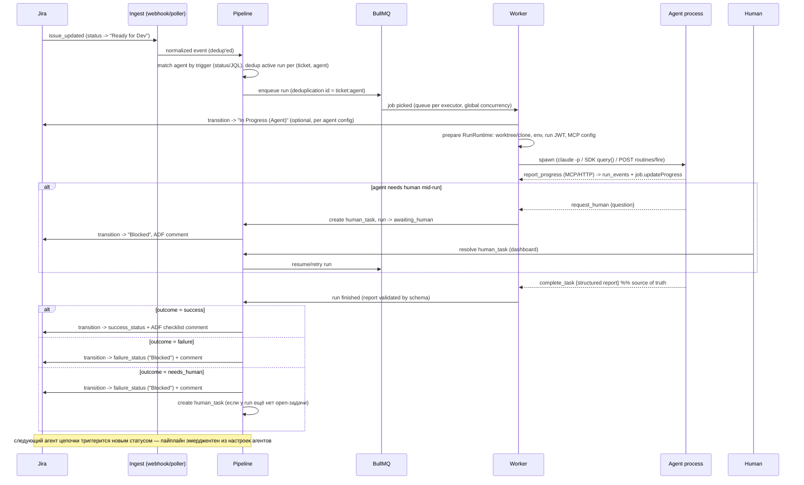

# BRIGADIR — Архитектура

Оркестратор пайплайнов AI-кодинг-агентов поверх Jira. Self-hosted-first, позже multi-tenant SaaS.

Базовые решения (зафиксированы): NestJS + Vue.js; Redis + BullMQ (только очереди); **Postgres — источник правды** по истории прогонов, чеклистам, логам и human-tasks; **Jira — источник правды по статусу тикета**; Jira webhooks для скорости + reconciliation-поллинг как гарантия.

---

## 1. Компоненты

```
                            ┌─────────────────────────────────────────────┐
                            │                 Jira Cloud                  │
                            │  (source of truth: ticket status)           │
                            └───────┬─────────────────────▲───────────────┘
                     webhooks /     │                     │  transitions, ADF comments,
                     JQL polling    │                     │  issue properties (per-issue write queue)
                            ┌───────▼─────────────────────┴───────────────┐
                            │              NestJS Backend                 │
                            │                                             │
   Vue.js Dashboard ◄──SSE──┤  JiraModule      ── client, rate-limiter,   │
   (checklists, runs,       │                     transition discovery,   │
    human-task queue)──REST─►                     ADF composer            │
                            │  IngestModule    ── webhook endpoint,       │
                            │                     reconciliation poller   │
                            │  PipelineModule  ── ticket state machine,   │
                            │                     agent matching, dedup   │
                            │  RunModule       ── run lifecycle, events,  │
                            │                     checks, reports         │
                            │  CallbackModule  ── HTTP callback API +     │
                            │                     Streamable HTTP MCP     │
                            │  HumanTaskModule ── human queue             │
                            │  ExecutorModule  ── AgentExecutor registry  │
                            └───────┬───────────────────▲─────────────────┘
                                    │ enqueue           │ complete_task /
                            ┌───────▼───────┐           │ report_progress /
                            │ Redis + BullMQ│           │ request_human
                            │ queue per     │           │
                            │ executor type │           │
                            └───────┬───────┘           │
                            ┌───────▼───────────────────┴─────────────────┐
                            │            Worker (NestJS WorkerHost)       │
                            │  RunRuntime (process │ docker/runsc │ SaaS  │
                            │  sandbox) + git worktree + secret broker    │
                            │        ┌──────────────────────────┐         │
                            │        │  Agent process:          │         │
                            │        │  claude -p / Agent SDK / │         │
                            │        │  OpenAI-compatible loop /│         │
                            │        │  Routines /fire (remote) │         │
                            │        │  + brigadir MCP tools    │         │
                            │        └──────────────────────────┘         │
                            └─────────────────────────────────────────────┘
```

Модули backend'а:

| Модуль | Ответственность |
|---|---|
| `JiraModule` | REST-клиент (v3), per-tenant rate-limiter (token bucket, 429 + `Retry-After`), **per-issue write queue** (лимит 20 записей/2 c), runtime transition discovery с кэшем и 409-ретраем, ADF-composer чеклистов, issue properties |
| `IngestModule` | `POST /webhooks/jira` (HMAC, дедуп по `X-Atlassian-Webhook-Identifier`), reconciliation-поллер (`/rest/api/3/search/jql`, `nextPageToken`, high-water mark по `updated`), webhook-refresh-крон (для 3LO-фазы) |
| `PipelineModule` | Машина состояний тикета: событие «тикет вошёл в trigger-статус агента» → дедуп → enqueue run; по `complete_task` → transition в success/failure-статус или Blocked + human task |
| `RunModule` | CRUD прогонов, таймлайн событий, чеклисты, стоимость/usage, retry/cancel |
| `CallbackModule` | Приём callback'ов от агентов: HTTP API + Streamable HTTP MCP endpoint; валидация per-run JWT |
| `ExecutorModule` | Реестр `AgentExecutor`, конфигурация, health-checks, backpressure |
| `HumanTaskModule` | Очередь «нужен человек»: создание из `request_human`/`complete_task`, резолюция → продолжение/ретрай пайплайна |

---

## 2. Диаграмма пайплайна тикета



Принципы:

1. **Пайплайн не описывается явно** — он эмерджентен: каждый агент подписан на trigger-статус/JQL и переводит тикет в целевой статус; цепочка статусов на доске и есть пайплайн. (Плюс: полная совместимость с ручным вмешательством через Jira.)
2. **Jira — источник правды по статусу**: оркестратор никогда не «считает» тикет находящимся в статусе, которого не видел в Jira; наше `tickets.last_seen_status` — кэш для diff'а, не правда.
3. **Идемпотентность на трёх уровнях**: дедуп webhook-событий (identifier), BullMQ `deduplication: {id}`, partial unique index в Postgres на активный прогон (ticket, agent).
4. **Завершение прогона = получение `complete_task`**. Единственное исключение — blocking `request_human`: он сам переводит run в `awaiting_human`, после чего процесс легитимно завершается без `complete_task` (Stop-hook это учитывает, см. §5). Любой другой выход процесса без `complete_task` = `failed` c диагностикой из exit JSON. Stop-hook (для Claude-executor'ов) принуждает агента вызвать тулзу.

---

## 3. Схема данных (Postgres)

```sql
-- ============ workspace & configuration ============

CREATE TABLE workspaces (
  id              uuid PRIMARY KEY DEFAULT gen_random_uuid(),
  name            text NOT NULL,
  jira_site_url   text NOT NULL,               -- https://acme.atlassian.net
  jira_project_key text NOT NULL,              -- BRIG
  jira_board_id   int,                         -- миграция итерации 2: привязка к борде
  jira_board_type text,                        -- kanban | scrum (определяется через Agile API при подключении)
                                               -- scrum => скоуп поллера = активный спринт (см. spec 0.3 и plan-internal п.5)
  jira_auth_type  text NOT NULL DEFAULT 'api_token',  -- api_token (решение 2026-07-10: основной способ; oauth_3lo — резерв полной продуктовой версии)
  jira_credentials bytea NOT NULL,             -- encrypted (AES-256-GCM, key from env/KMS)
  jira_credential_expires_at timestamptz,      -- API token <= 1 year: alerting!
  env_secrets     bytea,                       -- feature 031 (миграция 0010): sealed JSON-документ
                                               -- { workspace?, repos?:{repoId→env}, agents?:{agentId→env} }
                                               -- секретных env-значений всех трёх скоупов (тот же
                                               -- AES-256-GCM конверт/ключ). NULL = нет секретов. WRITE-ONLY
                                               -- (в ответах только имена ключей — env_secret_keys). Несекретный
                                               -- env лежит открыто в settings.env / settings.repositories[].env /
                                               -- agents.behavior.env. Инжектится в спаун ПОСЛЕ allowlist-floor и
                                               -- ДО auth/provider (platform-ключи всегда побеждают; allowlist не
                                               -- расширяется). Только repo-mounted прогоны (triage — нет)
  agent_instructions_token bytea,              -- feature 030 (миграция 0009): sealed токен ПРИВАТНОГО
                                               -- репо шаблонов ролей (тот же AES-256-GCM конверт/ключ,
                                               -- что jira_credentials). NULL = нет токена. Write-only
                                               -- (в ответах только has_agent_instructions_token); url/ref/
                                               -- subdir лежат в settings.agent_instructions
  settings        jsonb NOT NULL DEFAULT '{}', -- repositories[] (первый — дефолтный; feature 031: у каждой
                                               -- записи стабильный id + опц. env — несекретный per-repo env),
                                               -- env (feature 031: несекретные workspace-дефолты env), scope_jql,
                                               -- agent_instructions {git_url, git_ref?, subdir?} (feature 030,
                                               -- override глобального источника шаблонов ролей),
                                               -- branch_prefix (инертно с feature 024: на обёртку не
                                               -- влияет, хранится ради вперёд-совместимости конфигов),
                                               -- active_sprint_id, high-water mark поллера, git creds ref
  created_at      timestamptz NOT NULL DEFAULT now(),
  updated_at      timestamptz NOT NULL DEFAULT now()
);

-- ИМЕНОВАННЫЙ ПРОФИЛЬ РАННЕРА (2026-07-14; PLATFORM-scoped с миграции 0003,
-- решение 2026-07-13): executor — рантайм-профиль на всю платформу: транспорт
-- (type — реестр в коде, строки не создают поведения) + модель + лимиты +
-- опциональные креды. Агент — чистая роль, привязан к профилю через
-- agents.executor_id; модель агента НЕ принадлежит (legacy behavior.model
-- игнорируется рантаймом безусловно). Очередь run.<type> и суммарная
-- concurrency воркера и так были глобальными.
CREATE TABLE executors (
  id              uuid PRIMARY KEY DEFAULT gen_random_uuid(),
  type            text NOT NULL,               -- claude_routines | claude_cli | anthropic_api | deepseek_api
  name            text NOT NULL,               -- алиас профиля («команда/владелец раннера»), глобально уникален
  config          jsonb NOT NULL DEFAULT '{}', -- non-secret свойства ПРОФИЛЯ: model, max_turns, cli path, routine_id...
                                               -- (repository здесь БОЛЬШЕ НЕ живёт: берётся из agents.behavior.repository,
                                               --  иначе дефолтный репозиторий workspace прогона; leftover-ключ игнорируется)
  secrets         bytea,                       -- опциональный API-ключ профиля: JSON {api_key}, запечатан тем же
                                               -- AES-256-GCM конвертом, что jira_credentials (ключ BRIGADIR_CREDENTIALS_KEY).
                                               -- WRITE-ONLY через API (в ответах только has_api_key); ключ задан →
                                               -- рантайм инжектит ANTHROPIC_API_KEY в спаун (биллинг по ключу),
                                               -- нет → подписка хоста
  max_parallel_runs int NOT NULL DEFAULT 2,    -- кап ОДНОВРЕМЕННЫХ прогонов ЭТОГО профиля (processor-side gate
                                               -- считает running-прогоны по executor_id); concurrency воркера типа =
                                               -- СУММА по enabled-профилям (type capacity, boot + 15s re-apply)
  enabled         boolean NOT NULL DEFAULT true, -- false → исключён из type capacity, его джобы держит gate
  UNIQUE (name)
);

-- AUTH-РЕЖИМЫ claude_cli-профиля (feature 018, additive-ключи в config jsonb,
-- DDL не менялся): config.auth = host_subscription | api_key | bedrock.
-- bedrock несёт awsRegion (обязателен) + awsProfile/caBundlePath (опц.) —
-- НЕ секреты; AWS-креды в платформе не хранятся никогда (CLI читает ~/.aws
-- через allowlist'нутый HOME). Инжекция значений ПРОФИЛЯ (не шелла хоста)
-- строго ПОСЛЕ env-allowlist-прохода: CLAUDE_CODE_USE_BEDROCK=1, AWS_REGION,
-- AWS_PROFILE?, NODE_EXTRA_CA_CERTS? — сам allowlist не расширялся.
-- Дефолт для строк без auth (правило — resolveEffectiveAuth, единственная
-- реализация; ответы API всегда несут ЭФФЕКТИВНЫЙ режим): secrets задан →
-- api_key, иначе host_subscription — легаси-строки ведут себя байт-в-байт
-- как раньше. Секрет-блоб расшифровывается ТОЛЬКО в режиме api_key; при
-- переключении режима прочь от api_key блоб сохраняется инертным (очистка —
-- только явным api_key: null). Контракт: specs/018-bedrock-auth-mode/
-- contracts/executor-auth.md.

CREATE TABLE agents (
  id              uuid PRIMARY KEY DEFAULT gen_random_uuid(),
  workspace_id    uuid NOT NULL REFERENCES workspaces(id) ON DELETE CASCADE,
  executor_id     uuid NOT NULL REFERENCES executors(id),
  name            text NOT NULL,               -- feature 014: персона ("Achilles", "Hera"), presentation-only, редактируема, БОЛЬШЕ НЕ уникальна
  role            text,                        -- feature 014: функция ("Developer"/"QA"/"Reviewer"; оркестратор = "teamlead"), editable, nullable (backfill → NULL у воркеров)
  key             text NOT NULL,               -- feature 014: читаемый workspace-уникальный HANDLE на границе LLM/UI (routing, URLs, logs). Генерится СИСТЕМОЙ один раз при создании = slugifyAgentKey(name, role); ИММУТАБЕЛЕН, резолвится в id на границе. Зарезервирован "brigadir" — оркестратор.
  description     text,                        -- feature 010: roster line показывается оркестратору в handoff (nullable)
  instruction     text NOT NULL,               -- user prompt (без обёртки)
  is_orchestrator boolean NOT NULL DEFAULT false, -- feature 010: пер-workspace оркестратор "brigadir" (никогда не poll-триггерится, неудаляем, исключён из routing-таргетов; в resume-пикере ПРИСУТСТВУЕТ и преселектнут по умолчанию — answer-triage delta: резолв на него создаёт answer-triage run)
  trigger_status  text,                        -- Jira status name, ИЛИ:
  trigger_jql     text,                        -- дополнительный JQL-фильтр (AND)
  status_running  text,                        -- optional: куда перевести на время работы
  status_success  text NOT NULL,               -- у оркестратора — инертный placeholder (см. FR-007): completed-run оркестратора не делает generic transition
  status_failure  text NOT NULL,               -- обычно "Blocked"
  behavior        jsonb NOT NULL DEFAULT '{}', -- behavior options (см. §7); у оркестратора { workspace_mode: 'none' } → no-repo run
                                               -- feature 031: behavior.env — несекретный per-agent env override (высший слой)
  timeout_minutes int NOT NULL DEFAULT 45,
  max_budget_usd  numeric(8,2),
  max_attempts    int NOT NULL DEFAULT 2,
  enabled         boolean NOT NULL DEFAULT true,
  UNIQUE (workspace_id, key)                    -- feature 014: identity-constraint переехал name → key (name может повторяться). Один "brigadir" на workspace гарантируется зарезервированным key + is_orchestrator (seed insert-if-absent onConflict (workspace_id, key))
);

-- ============ global_settings (feature 010; feature 015 — шаблон бригадира) ============
-- Платформенный key-value store (без workspace FK). Ключи (feature 015,
-- секция Settings → "Brigadir agent", GET/PUT /api/brigadir-agent-settings;
-- старый /api/general-settings удалён, General оставил только Theme):
-- - brigadir_agent_template — ОДИН версионированный JSON-документ
--   (BrigadirAgentTemplateSchema, contracts): имя/роль/лимиты/enabled +
--   ДВА execution-профиля: triage (копируется в сидируемого оркестратора при
--   СОЗДАНИИ workspace — изменения влияют только на созданные позже, SC-006)
--   и setup (читается ЖИВЬЁМ каждым workspace-setup прогоном: сильная модель,
--   большой maxTurns, примонтированный дефолтный репозиторий workspace,
--   setup.timeout_minutes под клоны). Битое значение = built-in defaults.
-- - default_orchestrator_instruction (JSON-строка) — routing-инструкция,
--   копируется при СОЗДАНИИ workspace (SC-006);
-- - workspace_setup_instruction (JSON-строка) — setup-протокол, live-read.
-- Ключи инструкций НЕ переименовывались при переезде секции (feature 015) —
-- правки операторов пережили смену эндпоинта без миграции.
-- Принцип "у оркестратора нет репозитория и git-кредов" (feature 010 FR-018,
-- Constitution V) СУЖЕН фичей 015 до TRIAGE-прогонов: setup-прогоны получают
-- read-only-по-поведению репо-доступ (нет push-пути, локальная ветка
-- setup/<runId8>, протокол предписывает только чтение) на общем ssh-agent
-- посте всех репо-прогонов; обоснование — plan.md фичи 015, Constitution Check.
-- Встроенные executor-профили: brigadir-orchestrator (triage, Haiku, no-repo)
-- и brigadir-setup (setup, Sonnet, 60 turns) — оба insert-if-absent.
-- Delete-guard оркестратора — в API
-- (agents.controller → 409), не в БД, чтобы правки instruction/enabled работали.
CREATE TABLE global_settings (
  key             text PRIMARY KEY,
  value           jsonb NOT NULL,
  updated_at      timestamptz NOT NULL DEFAULT now()
);

-- ============ tickets & runs ============

CREATE TABLE tickets (
  id              uuid PRIMARY KEY DEFAULT gen_random_uuid(),
  workspace_id    uuid NOT NULL REFERENCES workspaces(id) ON DELETE CASCADE,
  jira_key        text NOT NULL,               -- BRIG-123
  jira_id         text NOT NULL,
  summary         text,
  last_seen_status text,                       -- кэш для diff, НЕ источник правды
  last_seen_updated timestamptz,               -- кэш updated тикета; high-water mark поллера живёт в workspaces.settings
  priority_id     int,                         -- кэш Jira priority.id (feature 022); ASC = важнее; NULL = без приоритета
  priority_name   text,                        -- кэш имени приоритета для дашборда (feature 022)
  blocked_by      jsonb,                       -- кэш открытых blocked-by ключей, string[] (feature 022); NULL = не ждёт
  blocked_state   text,                        -- waiting | cycle | dead_end | out_of_scope (feature 022); NULL = не ждёт
  UNIQUE (workspace_id, jira_key)
);

CREATE TABLE runs (
  id              uuid PRIMARY KEY DEFAULT gen_random_uuid(),
  workspace_id    uuid NOT NULL REFERENCES workspaces(id),
  ticket_id       uuid REFERENCES tickets(id),  -- NULL: бестикетный workspace-setup прогон (feature 011)
  agent_id        uuid NOT NULL REFERENCES agents(id),
  executor_type   text NOT NULL,
  status          text NOT NULL DEFAULT 'queued',
    -- queued | running | awaiting_human | succeeded | failed | cancelled | timed_out | superseded
    -- superseded: закрыт resume'ом human-task (на его месте создан новый attempt, см. spec 1.4)
  attempt         int NOT NULL DEFAULT 1,
  trigger_event   jsonb,                       -- что запустило: manual|webhook|poll|human-resume|triage|rework|answer-triage|workspace-setup (feature 010 + answer-triage delta + feature 011); handoff-поля failing_run_id/deciding_run_id/human_task_id/target_agent/task ездят здесь же
  external_ref    text,                        -- claude session_id / routines session_url
  worktree_path   text,
  started_at      timestamptz,
  finished_at     timestamptz,
  exit_code       int,
  cost_usd        numeric(10,4),
  usage           jsonb,                       -- tokens, cache hit rate
  error           text,
  report          jsonb,                       -- полный structured report (см. §6)
  outcome         text,                        -- success | failure | needs_human (из report)
  created_at      timestamptz NOT NULL DEFAULT now()
);
-- третий рубеж идемпотентности: один активный прогон на (ticket, agent)
CREATE UNIQUE INDEX runs_one_active ON runs (ticket_id, agent_id)
  WHERE status IN ('queued', 'running', 'awaiting_human');
-- feature 011: NULL'ы в unique-индексе различны, поэтому бестикетные прогоны
-- охраняет парный индекс — максимум ОДИН активный setup-прогон на workspace
CREATE UNIQUE INDEX runs_one_active_setup ON runs (workspace_id)
  WHERE status IN ('queued', 'running', 'awaiting_human') AND ticket_id IS NULL;
CREATE INDEX runs_ticket ON runs (ticket_id, created_at DESC);

CREATE TABLE run_checks (                       -- чеклист UI строится отсюда
  id              uuid PRIMARY KEY DEFAULT gen_random_uuid(),
  run_id          uuid NOT NULL REFERENCES runs(id) ON DELETE CASCADE,
  position        int NOT NULL,
  name            text NOT NULL,
  status          text NOT NULL,               -- pass | fail | skip | warn
  reason          text
);

CREATE TABLE run_events (                       -- таймлайн прогона
  id              bigint GENERATED ALWAYS AS IDENTITY PRIMARY KEY,
  run_id          uuid NOT NULL REFERENCES runs(id) ON DELETE CASCADE,
  type            text NOT NULL,               -- progress | log | tool_call | api_retry | error | jira_action
  payload         jsonb NOT NULL,
  created_at      timestamptz NOT NULL DEFAULT now()
);
CREATE INDEX run_events_run ON run_events (run_id, id);

-- ============ human queue ============

CREATE TABLE human_tasks (
  id              uuid PRIMARY KEY DEFAULT gen_random_uuid(),
  workspace_id    uuid NOT NULL REFERENCES workspaces(id),
  run_id          uuid REFERENCES runs(id),
  ticket_id       uuid REFERENCES tickets(id),  -- NULL: задача setup-прогона (review/failure/question, feature 011)
  kind            text NOT NULL,               -- question | blocker | review
  title           text NOT NULL,               -- короткая формулировка для человека
  details         text,
  options         jsonb,                       -- feature 013: предложенные варианты ответа (AnswerOption[] 1–5, см. §5/§6); NULL у системных задач и вопросов без вариантов
  blocking        boolean NOT NULL DEFAULT true, -- true: run ждёт (awaiting_human)
  status          text NOT NULL DEFAULT 'open',  -- open | resolved | dismissed
  resolution      text,                        -- ответ человека (передаётся агенту при resume)
  created_at      timestamptz NOT NULL DEFAULT now(),
  resolved_at     timestamptz,
  resolved_by     text
);
CREATE INDEX human_tasks_open ON human_tasks (workspace_id, status) WHERE status = 'open';

-- ============ ingest idempotency ============

CREATE TABLE webhook_events (
  id              uuid PRIMARY KEY DEFAULT gen_random_uuid(),
  workspace_id    uuid NOT NULL REFERENCES workspaces(id),
  external_id     text NOT NULL,               -- X-Atlassian-Webhook-Identifier
  event_type      text NOT NULL,
  payload         jsonb NOT NULL,
  processed_at    timestamptz,
  created_at      timestamptz NOT NULL DEFAULT now(),
  UNIQUE (workspace_id, external_id)
);

-- Phase 3+: users, workspace_members, api_keys, audit_log, runner_nodes
```

Redis — только очереди BullMQ (`run.<type>` из `RUN_QUEUE_EXECUTOR_TYPES` через `runQueueName`: сейчас `run.mock`, `run.claude_cli`, `run.kimi`, `run.deepseek_api`; + `reconcile`) + флаги отмены `run:{id}:cancelled`. Per-issue write queue Jira — in-process (`p-queue` по issue key), не BullMQ: OSS-версия per-key сериализацию из коробки не даёт.

---

## 4. Абстракция AgentExecutor

```ts
// Один контракт, четыре реализации. Executor НЕ знает про Jira и BullMQ —
// он получает подготовленный RunContext и обязан доставлять callbacks.

export interface RunContext {
  runId: string;
  ticket: { key: string; summary: string; description: string; url: string };
  instruction: string;            // уже обёрнутая (см. §7)
  workspaceDir: string | null;    // worktree; null для remote executors (Routines)
  callback: {
    httpBaseUrl: string;          // https://brigadir.local/api/callbacks
    runToken: string;             // short-lived JWT {runId, ticketKey, exp}
    mcpStdioCmd?: string[];       // как поднять stdio-сервер (для CLI executors)
  };
  limits: { timeoutMs: number; maxBudgetUsd?: number; maxTurns?: number };
  env: Record<string, string>;    // sanitized! никакого ANTHROPIC_API_KEY из окружения хоста
  // Примечание (feature 031): операторский env НЕ едет через это поле — компоновка
  // (workspace ⊕ mounted repos ⊕ agent, плюс расшифрованные секреты) происходит
  // ВНУТРИ ClaudeCliExecutor.loadRunConfig (только там известен итоговый набор
  // смонтированных репо) и инжектится в спаун ПОСЛЕ allowlist-floor и ДО auth/provider.
}

export interface ExecutorResult {
  // Итог ПРОЦЕССА, не отчёта: отчёт приходит через CallbackModule.
  exitStatus: 'completed' | 'crashed' | 'timeout' | 'rate_limited' | 'cancelled';
  externalRef?: string;           // session_id / session_url
  costUsd?: number;
  usage?: unknown;
  diagnostics?: string;           // stderr tail / exit JSON
}

export interface AgentExecutor {
  readonly type: 'claude_cli' | 'kimi' | 'anthropic_api' | 'deepseek_api' | 'claude_routines';
  /** Полный жизненный цикл одного прогона. Резолвится по завершении процесса/сессии. */
  run(ctx: RunContext, signal: AbortSignal): Promise<ExecutorResult>;
  /** Проверка конфигурации (auth жив, CLI установлен, routine отвечает). */
  healthCheck(): Promise<{ ok: boolean; detail?: string }>;
}
```

### Реализации

Статус: `mock`, `claude_cli`, `kimi` и `deepseek_api` — реализованы; `anthropic_api` / `claude_routines` — план.

| | `claude_cli` | `kimi` (feature 025) | `deepseek_api` (feature 028) | `anthropic_api` | `claude_routines` |
|---|---|---|---|---|---|
| Механика | `spawn('claude', ['-p', ...])`, `detached: true`, kill process group | ТОТ ЖЕ Claude CLI harness, параметризованный provider-пресетом: `ANTHROPIC_BASE_URL=https://api.moonshot.ai/anthropic` (хардкод-константа, замаплена на тип; НЕ конфигурируется оператором, нигде не хранится и не отдаётся API/UI) | ТОТ ЖЕ Claude CLI harness, третий provider-пресет: `ANTHROPIC_BASE_URL=https://api.deepseek.com/anthropic` (официальный Anthropic-совместимый endpoint DeepSeek; та же дисциплина константы, что у kimi). Прежний «план A» (Agent SDK напрямую) не понадобился — CLI-harness покрыл всё | Agent SDK `query()` in-process | `POST /v1/claude_code/routines/{id}/fire` |
| Auth | Подписка пользователя (login/`setup-token`); **легально только на машине пользователя** | Moonshot API key (BYOK), неявно api_key-only: нет auth-селектора, нет host_subscription/bedrock. Ключ — write-only, sealed (AES-256-GCM), инжектится `ANTHROPIC_API_KEY` из профиля ПОСЛЕ allowlist; профиль без ключа не создать/не сохранить и он падает fail-fast на прогоне | DeepSeek API key (BYOK), неявно api_key-only — те же правила, что у kimi (общий набор `API_KEY_ONLY_EXECUTOR_TYPES`, FR-016 фичи 028: guard'ы/контроллер/форма расширяются одной константой, а не третьим `if`) | `ANTHROPIC_API_KEY` (BYOK) | Per-routine fire token |
| Structured report | MCP stdio `complete_task` + `--json-schema` как fallback | как `claude_cli` (тот же harness: brigadir-mcp + Stop hook) | как `claude_cli`; client-side stdio MCP (callback-канал) работает против DeepSeek — «MCP unsupported» в их доках касается только серверного API-коннектора (подтверждено live-smoke 2026-07-22: report через `complete_task`, 3× `report_progress` на таймлайне) | In-process SDK MCP `complete_task` + `outputFormat` fallback | HTTP callback `complete_task` (URL+токен в тексте триггера/промпте routine) |
| Rate-limit сигнал | stream-json `system/api_retry {error:"rate_limit"}` | как `claude_cli` (формат стрима не меняется — бинарь тот же) | как `claude_cli` | SDK message stream / 429 headers | 429 + `Retry-After` на `/fire` |
| Результат процесса | exit + result JSON | как `claude_cli` | как `claude_cli` | `SDKResultMessage` | **fire-and-forget**: завершение = только callback или таймаут |
| Особенности | `--strict-mcp-config`, env-санация (API-ключ перебивает подписку!) | first-class тип (иммутабельный `runs.executor_type = 'kimi'`, своя очередь `run.kimi`) — имя = провайдер, не транспорт, так что harness можно позже сменить на нативный kimi-cli без миграции истории/аналитики. `ANTHROPIC_BASE_URL` НИКОГДА не в allowlist (host-значение не утечёт ни в один прогон). `cost_usd` **индикативен**: CLI считает по прайс-листу Anthropic, не Moonshot — помечается в UI (маркер `~` на стоимости kimi-прогона) и здесь; пересчёт по ценам Moonshot — вне scope | first-class тип, своя очередь `run.deepseek_api`. `config.model` — НАТИВНЫЕ id DeepSeek (`deepseek-v4-pro` / `deepseek-v4-flash`); **нераспознанное имя модели endpoint молча роутит в `deepseek-v4-flash`** (ошибки нет — предупреждение в хинте формы; per-model cap `EXECUTOR_MODEL_LIMITS` ключуется по сконфигурированной строке). **Известное ограничение (smoke 2026-07-22): endpoint НЕ возвращает usage через CLI-result → `cost_usd`/`usage` на deepseek-прогонах NULL** (UI показывает «—»; индикативный маркер — только при наличии значения; бюджет-чек по cost на таких прогонах фактически не срабатывает) | `permissionMode:'dontAsk'`, `allowedTools` + policy-деградация: no-vision routing, недоверие self-report, строгие tool-схемы (beta strict) | обязателен заголовок `anthropic-beta: experimental-cc-routine-2026-04-01`; `text` ≤ 65 536; дедуп на нашей стороне (нет idempotency key); нет отмены; watchdog-таймаут; **привязка к личному аккаунту claude.ai** — действия в Jira/git от имени владельца routine, дневной cap на запуски |

Примечание к `claude_routines`: поскольку `/fire` принимает только текст, callback URL + run-токен вшиваются в текст триггера (`{"text": "ticket=BRIG-123 callback=https://... token=..."}`), а сохранённый промпт routine инструктирует репортить результат POST'ом. Это самый слабый канал — поэтому для Routines обязателен watchdog: нет callback'а за `timeout_minutes` → `failed`, тикет в Blocked, human task. `healthCheck()` для Routines не может проверить «routine отвечает» (read-API нет, а `/fire` создаёт реальную сессию) — только наличие/формат токена и давность последнего успешного fire. Cancel облачной сессии невозможен: run помечается `cancelled` локально, поздний `complete`-callback отсекается по статусу (409).

Разрешения инструментов (`claude_cli`, ST3-768): прогон всегда стартует с `--permission-mode dontAsk` — всё, чего нет в allowlist, автоматически денаится. Allowlist резолвится в порядке `executors.config.allowedTools` → `agents.behavior.allowed_tools` → платформенный дефолт `DEFAULT_REPO_RUN_ALLOWED_TOOLS` (полный кодинг-набор с нелимитированным Bash; guardrails — worktree/timeout/бюджет, а не гранулярность тулзов). Дефолт применяется ТОЛЬКО к repo-mounted прогонам и ПОСЛЕ резолва репозитория: triage (`workspace_mode: 'none'`) и setup-прогон, деградировавший в no-repo путь (FR-017), остаются с пустым allowlist. Для callback-прогонов поверх доклеиваются `mcp__brigadir__*`. Права — это argv процесса, они фиксируются на спауне: «выдать права» работающему или следующему прогону через rework/human-resume невозможно by design — сужение/расширение делает оператор в конфиге профиля или агента; brigadir'у это явно запрещено triage-инструкцией (не обещать «permissions enabled», permission-фейлы → `needs_human` с указанием, какое поле конфига править).

Маппинг `ExecutorResult.exitStatus` → `runs.status`: `completed` → по отчёту (`succeeded` / `failed` / `awaiting_human`), `crashed` → `failed` (с ретраями по backoff), `timeout` → `timed_out`, `rate_limited` → job возвращается в очередь (run остаётся активным), `cancelled` → `cancelled`.

`cost_usd`/`usage` приходят только в terminal-событии стрима CLI и потому для callback-прогонов пост-датируют финализацию (`complete_task` срабатывает до выхода процесса). Worker пишет их отдельным status-independent апдейтом по run id (`RunsService.recordCostUsage`, best-effort, вне state-machine статусов) после settle executor'а — на любом exit-пути; побеждает последняя CLI-сессия, приславшая result-событие. Чтобы result-событие вообще успело родиться, cancel-poll после **callback-финализации** (succeeded/failed) даёт процессу ограниченный grace на естественный выход (`postFinalizeGraceMs`, дефолт 30 с) вместо немедленного kill; явная отмена пользователем (`cancelled`) и парковка `awaiting_human` (процесс завис на blocking-вызове) по-прежнему убиваются сразу.

### Очереди и backpressure

- Очередь на executor-тип; `setGlobalConcurrency(executor.concurrency_limit)`.
- 429/лимит подписки → `worker.rateLimit(ttl)` + `Worker.RateLimitError()` (attempt не расходуется); ttl — из `Retry-After`/`retry_delay_ms`; для 5-часовых окон подписки момент сброса программно недоступен → эвристика (15 мин, при повторном упоре 60 мин).
- Крэш/timeout → exponential backoff + jitter, `max_attempts` из агента; невосстановимое (auth, ToS-блок) → `UnrecoverableError`.
- Reconciliation-sweeper (`upsertJobScheduler`, каждые 5 мин): (a) поллинг Jira против `last_seen_*`; (b) починка расхождений runs ↔ queue ↔ живость child-процессов; (c) webhook-refresh (3LO-фаза).

### Durable-финализация: guard, проба, реконсайлер (feature 026)

Пост-мортем прогона `3f60c1a1` (2026-07-20): QA-агент вычислил верный PASS,
15 минут долбился в мёртвый callback-канал, прогон завершился `cancelled` с
`outcome=NULL` — вердикт потерян, хотя целиком лежал в outbox агента. Четыре
независимых страховки закрывают это (все — только для callback-wired прогонов;
Phase-0 не затронут):

- **Deployment guard («merged = deployed»).** Воркер спавнит вручную собранный
  `packages/mcp-server/dist/main.js`. Гвард (`libs/executors/.../artifact-guard.ts`)
  проверяет, что артефакт существует и не старше самого свежего файла в
  `packages/mcp-server/src/**` (сравнение mtime на одной машине). Нарушение —
  громкий отказ (Принцип «лучше упасть, чем тихо гонять устаревший код»):
  на старте воркера — error-баннер (воркер стартует), на pickup callback-wired
  прогона — жёсткий `failed` с явной ошибкой ДО спавна. Мемоизация 10 c ⇒
  ребилд лечит без рестарта. Пути overridable: `BRIGADIR_MCP_SERVER_ENTRY` /
  `BRIGADIR_MCP_SERVER_SRC`. Сборка вшита в `start:worker`, `build` и Docker-образ,
  так что гвард — трипваер, срабатывающий почти никогда.
- **Pre-flight channel probe.** Перед спавном воркер пробит `GET
  /api/callbacks/health` (`AbortSignal.timeout(2s)`, alive ⇔ 2xx). Мёртвый
  канал ⇒ прогон НЕ спавнится и НЕ жжёт попытку: hold через тот же
  `worker.rateLimit(ttl)` + `Worker.RateLimitError()`, что и rate-limit, с
  экспоненциальным backoff (30 c·2ⁿ, cap 5 мин) и событием `channel_down`
  (операторская видимость; при ≥3 подряд — error-алерт). Защищает от
  environment-outage (бэкенд лежит), НЕ от client-багов и не от смерти канала
  посреди прогона — их закрывают outbox + реконсайл.
- **Exit-time outbox reconcile (расширен).** При выходе процесса callback-wired
  прогона, если complete_task так и не долетел, но в
  `<configRoot>/.brigadir-outbox/<runId>.json` лежит валидный отчёт: ветка
  `completed`-exit (fail-closed) финализирует его штатным guarded-путём
  (`finalizeWithReport`, скрабится как живой callback); ветка `timed_out` —
  как раньше, но теперь тоже скрабит (закрыт пробел Принципа V); `cancelled` —
  статус НЕ трогаем, отчёт цепляем событием `undelivered_report` и файл
  консьюмим. Невалидный/битый файл сохраняется на диске для разбора (FR-007).
- **Периодический outbox-реконсайлер** (`OutboxReconcileScheduler`,
  `upsertJobScheduler('outbox-reconcile', { every: 60_000 })`, идемпотентен по
  id — паттерн reconcile-шедулера): скан `<configRoot>/.brigadir-outbox/*.json`
  раз в минуту, решает по ТЕКУЩЕМУ статусу прогона (файл не переопределяет
  Postgres, Принцип I): `running` / терминально-плохой с `outcome IS NULL`
  (`failed`/`timed_out`) → `reconcileWithReport` (расширенный guard
  `WHERE active OR (failed/timed_out AND outcome IS NULL)`, гонка с живым
  callback безопасна через flipped-флаг); `cancelled`/`superseded` →
  `undelivered_report`, статус не трогаем; финализированный с исходом /
  неизвестный run → консьюм+лог; `awaiting_human` → skip, файл НЕ трогаем
  (живой human-путь). Ретеншн: неразрешимые файлы (битые, не-UUID имя) хранятся
  7 дней, затем удаляются. Жизнь outbox-директории развязана с per-run cleanup
  (её убирает только реконсайлер). Config-root резолвится лениво через
  `resolveMcpConfigRoot()` (env `BRIGADIR_MCP_CONFIG_ROOT`), один источник
  правды для писателя (executor), tool-сервера и всех читателей.

Feature 027 (callback-channel resilience ops) добавляет поверх 026:

- **Эксклюзивный worker-lock** (`apps/worker/src/worker-lock.service.ts` +
  bootstrap): все консьюмеры очередей (`run.*` + оба реконсайлера) объявлены с
  `autorun: false` и стартуют главный цикл ТОЛЬКО после взятия Redis-лока
  `<BULLMQ_PREFIX>:worker-lock` (SET NX PX, TTL `BRIGADIR_WORKER_LOCK_TTL_MS`
  дефолт 15 c, продление TTL/3 через compare-and-extend Lua). Второй worker на
  том же неймспейсе не потребляет НИЧЕГО и каждые ~2 c пишет ERROR c identity
  держателя + ставит contender-ключ, который держатель тоже логирует ERROR'ом
  (громко с обеих сторон). Shutdown: свой drain (`worker.close()`), ПОТОМ
  release — переключение режимов всегда drain-based; смерть держателя без
  release ⇒ takeover ≤ TTL. Лок — transient-координация (Принцип I), три слоя
  идемпотентности не заменяет.
- **Стабильный режим для агент-прогонов** (`scripts/agents-mode.mjs`,
  `pnpm agents:start|stop|status`, docs/local-setup.md §2a): вторая native
  non-watch пара backend+worker из собранных бандлов на `BRIGADIR_AGENTS_PORT`
  (дефолт 3210); worker пары получает
  `BRIGADIR_CALLBACK_BASE_URL=http://127.0.0.1:<port>/api/callbacks`.
  Callback-цель агентов отвязана от dev-стека человека на :3000 (SPOF
  пост-мортема 2026-07-19/20). Guard/probe/outbox работают идентично: те же
  dist-пути (cwd = корень репо) и тот же общий `resolveMcpConfigRoot()`.
- **Channel-failure breadcrumbs** (`packages/mcp-server/src/channel-breadcrumbs.ts`
  → `<configRoot>/.brigadir-channel/<runId>.jsonl`): при исчерпании retry-бюджета
  любой callback-тулзы (network-бюджет ИЛИ 5xx-бюджет) tool-сервер append'ит одну
  summary-строку (best-effort, кап 64 KB на прогон). Worker переливает файл в
  `run_events` `channel_failure` на КАЖДОЙ терминальной ветке callback-wired
  прогона и вторым сканом периодического реконсайлера (только терминальные
  прогоны; активным агент ещё дописывает). Идемпотентность двух путей —
  атомарный rename-claim (`.jsonl` → `.jsonl.ingesting`); ingestion никогда не
  пишет статус/outcome (правило 7); ретеншн неатрибутируемых файлов и
  осиротевших claim'ов — как у outbox (7 дней).
- **`GET /api/channel-health`** (dashboard-bearer, additive; контракт
  `ChannelHealthResponseSchema`): derived-on-demand агрегат — оконные счётчики
  `channel_failure`/`channel_down` (окно `BRIGADIR_CHANNEL_HEALTH_WINDOW_MS`,
  дефолт 15 мин), `last_successful_callback_at` (progress-события с
  additive-тегом `via:'callback'` — только реально полученные backend'ом),
  вердикт deployment guard'а (backend зовёт `checkMcpServerArtifact` сам —
  общая ФС в native-pair режиме), `affected_runs` (distinct, cap 20).
  degraded ⇔ probe-отказ ≥ 1 ИЛИ channel_failures ≥ порога
  (`BRIGADIR_CHANNEL_HEALTH_FAILURE_THRESHOLD`, дефолт 3) ИЛИ guard не ok.
  Observability-only: admission-контроль остаётся у pre-flight probe. UI:
  индикатор в сайдбаре (5-секундный поллинг) + маркер `callback_alert` в
  списке прогонов (EXISTS по `undelivered_report`/`channel_failure` — проекция
  механизма 026, не второй механизм).

---

## 5. Протокол callback'ов (MCP + HTTP)

### Единый контракт тулз (один zod-модуль → четыре биндинга)

```ts
export const CallbackTools = {
  report_progress: z.object({
    percent: z.number().min(0).max(100).optional(),
    stage: z.string(),               // "exploring" | "implementing" | "testing" | ...
    message: z.string().max(500),
  }),
  request_human: z.object({
    kind: z.enum(['question', 'blocker', 'review']),
    title: z.string().max(120),      // короткая формулировка для очереди
    details: z.string().max(4000),
    blocking: z.boolean().default(true), // true => агент ждёт ответа (или завершает run как awaiting_human)
    // feature 013: предложенные варианты ответа — кнопки в human queue; free text, скраббится как title/details
    options: z.array(z.object({
      label: z.string().min(1).max(80),          // текст кнопки
      value: z.string().min(1).max(500).optional(),      // что уйдёт ответом (default: label)
      description: z.string().min(1).max(200).optional() // вторичная подсказка
    }).strict()).min(1).max(5).optional(),
  }),
  complete_task: ReportSchema,       // см. §6 — финальный отчёт как аргументы тулзы
  // feature 011: read-only Jira-тулзы — «глаза, не голос». Доступны КАЖДОМУ
  // callback-wired прогону; чтения исполняет система через Jira-доступ
  // workspace'а прогона (агент кредов не видит), write-поверхности нет.
  get_project_overview: z.object({}),                 // тип борды, статусы workflow, типы задач, активный спринт
  search_tickets: z.object({                          // структурные фильтры — сырой JQL НЕ принимается,
    text: z.string().max(200).optional(),             // project-скоуп компонует сервер (побег через OR project= невозможен)
    status: z.string().max(100).optional(),
    issue_type: z.string().max(100).optional(),
    max_results: z.number().int().min(1).max(50).optional(),
  }),
  get_ticket: z.object({ key: z.string().max(50) }),  // описание + последние комментарии (≤20) + линки; ответы size-bounded с флагом truncated
};
```

Биндинги:

1. **stdio MCP** (`claude_cli`): отдельный бинарь `brigadir-mcp`; подключается через `--mcp-config {worktree}/.brigadir/mcp.json`, где значения env заданы как `${BRIGADIR_RUN_TOKEN}` и т.п. — подставляются из env процесса `claude`, который выставляет воркер. Токен не попадает ни в argv (виден в `ps`), ни в файл на диске. Каждый handler = `POST` на HTTP API ниже. stdout — только протокол, логи в stderr.
2. **In-process SDK MCP** (`anthropic_api`, `deepseek_api` план A): `createSdkMcpServer` — handlers замыкаются на run-сервисы напрямую, без HTTP и токена.
3. **OpenAI functions** (`deepseek_api` план B): те же схемы в `tools[]`, исполняет сам цикл.
4. **HTTP API / Streamable HTTP MCP** (`claude_routines`, будущие remote executors): endpoints ниже, либо `/mcp` (Streamable HTTP) с теми же тулзами.

### HTTP API callback'ов

```
POST /api/callbacks/runs/:runId/progress    Authorization: Bearer <run JWT>
POST /api/callbacks/runs/:runId/human
POST /api/callbacks/runs/:runId/complete    body = structured report
GET  /api/callbacks/runs/:runId/jira/overview          (feature 011, read-only)
POST /api/callbacks/runs/:runId/jira/search            body = структурные фильтры
GET  /api/callbacks/runs/:runId/jira/tickets/:key      403 out_of_scope вне проекта workspace'а
GET  /api/callbacks/health                             (feature 026, БЕЗ авторизации) → 200 {status:'ok'}
```

`GET /api/callbacks/health` (feature 026) — аддитивный неаутентифицированный
liveness для pre-flight-пробы воркера: статичное тело, без БД, без версий/конфига
(ничего чувствительного); отдельный контроллер, а не роут на гардированном
`runs/:runId`, чтобы guard-поверхность осталась нетронутой. 200 доказывает, что
HTTP-стек бэкенда поднят и роутит (класс аварии 2026-07-19). Два новых типа
`run_events` (свободный text-столбец, миграций нет): `undelivered_report`
(`{report, run_status: cancelled|superseded, source: exit_reconcile|periodic_reconcile}`
— спасённый вердикт на прогоне, чей статус менять нельзя; отчёт валиден по
`ReportSchema` и проскраблен) и `channel_down`
(`{probe_url, consecutive, retry_in_ms}` — неудачная проба, секретов нет). Feature 027
добавляет третий тип `channel_failure` (`{ts, tool, kind: network|http, attempts,
error:{name,message}, status?, target, occurred_at, source: exit|reconcile}` —
переливка client-side breadcrumb'а «доставка callback'а исчерпала ретраи»;
`target` — только host:port, `error.message` скрабится при ingestion'е). Дашборд
рендерит все три (`RunTimeline`), неизвестные типы деградируют в generic-карточку.

Аутентификация: **short-lived JWT per run** `{ sub: runId, wsp: workspaceId, tkt?: ticketKey (нет у бестикетных setup-прогонов, feature 011), exp = started_at + timeout + grace }` (единый набор claims фиксируется в `packages/contracts`), подписан ключом backend'а. Инжектируется в env MCP-процесса / в конфиг executor'а; **модель токен не видит** (он живёт в процессе тулзы), для Routines — видит (ограничение канала), поэтому токен максимально узкий: один run, короткий TTL, только callback-скоупы. Guard: подпись + `runId` из пути == `sub` + run в статусе `running/awaiting_human`.

Семантика:

- `progress` → `run_events` + `job.updateProgress()` + SSE в дашборд.
- `human` (blocking=true) — канонический flow: создаётся human_task (с `options`, если агент их приложил — feature 013), run → `awaiting_human`, тикет → Blocked + ADF-коммент с вопросом (options — plain-списком «Suggested answers», кнопок в Jira нет — ответ в дашборде); в ответе агенту — инструкция «finish now without complete_task, the system will resume you with the answer». Маркер завершения (см. Enforcement) пишется самим `request_human`, поэтому Stop-hook выпустит агента. Resume закрывает старый run как `superseded` и создаёт новый attempt с `resolution` в контексте; answer-triage delta: эффективный resume-таргет по умолчанию — оркестратор (пикер преселектит brigadir) ⇒ новый run — `answer-triage` (brigadir читает Q&A + отчёт упавшего run'а и роутит через `routed`; его rework освобождён от override'а исчерпанного бюджета — ответ человека даёт один доп. цикл). Выбор worker-агента в пикере — прямой resume как раньше. Non-blocking — только задача в очереди, run продолжается.
- `complete` → валидация по `ReportSchema` (zod) → **completion-gate (feature 024, см. ниже)** → транзакция: runs.report/outcome/checks + решение PipelineModule (transition в Jira; для `needs_human` — human_task, только если у run ещё нет open-задачи: дедуп per run) → ACK агенту. Повторный `complete` для завершённого run → 409 (идемпотентность).

**Completion-gate (feature 024)** — детерминированный бэкстоп против «агент закоммитил, но не заявил ветку»: тихий старт следующей стадии с дефолтной ветки и ложный success. При `complete` до финализации:
  - MCP-сервер (единственный системный процесс рядом с воркти на момент `complete_task`) снимает `git rev-parse HEAD` по каждому воркти из `BRIGADIR_REPO_DIRS` (repo→dir, доставляется в 0600 env-блоке tool-сервера рядом с run-токеном — Принцип V; репо с ошибкой rev-parse опускается, доказательство наблюдается, не подделывается) и шлёт их в заголовке запроса `x-brigadir-observed-heads` (тело POST — неизменный `ReportSchema.strict()`; заголовок ставит сам tool-сервер, вне input-схемы тулзы, агент его не подделает).
  - Бэкенд сравнивает наблюдённые HEAD со `startSha`, записанным при подготовке в события `start-ref` (см. §7), точным неравенством (amend/reset тоже «сдвинулся»). Репо, чей HEAD сдвинулся И для которого отчёт не называет ветку (`normalizeReportArtifacts` — та же единственная реализация precedence; v1-плоский атрибутируется единственному смонтированному репо), — нарушение. Отчёт отклоняется как validation-failure (тот же посыл, что невалидный team-отчёт: прогон остаётся `running`, агент пушит, добавляет запись `artifacts.repos` и повторяет `complete_task`), пишется событие `run_events` `source: 'handoff-violation'`. Неисправленное нарушение приходит к `failed` штатным fail-closed путём выхода-без-complete — ложный success невозможен.
  - Молчит при отсутствии доказательств: нет заголовка, нет `start-ref`-базы (бестикетные triage/setup, Phase-0), репо не наблюдён. Размещение — именно в `complete_task`, а не в exit-проверке: `complete` финализирует прогон и ставит Jira-transition в очередь ДО выхода процесса, поэтому exit-проверка не может быть контролем (гвард правила 7 сделал бы поздний fail no-op'ом).

### Enforcement

Для Claude-executor'ов — `Stop`-hook: если ни `complete_task`, ни blocking `request_human` не вызывались в этой сессии (проверка по маркер-файлу, который пишет MCP-сервер после любого из них), hook возвращает `{"decision": "block", "reason": "You must call mcp__brigadir__complete_task with your final report before finishing."}`. Плюс жёсткий пояс: процесс завершился без `complete` и не в `awaiting_human` → статус из fallback-каналов (`--json-schema` structured_output, если есть) → иначе `failed`.

### Админская плоскость: `brigadir-admin` (feature 012)

Отдельный stdio MCP-сервер `brigadir-admin` (`packages/admin-mcp`) — НЕ путать с
callback-MCP выше. Жирная граница между плоскостями:

| | callback-MCP (`brigadir-mcp`, §5 выше) | admin-MCP (`brigadir-admin`, feature 012) |
|---|---|---|
| Кто | агент ВНУТРИ прогона | человек + Claude Code СНАРУЖИ прогона |
| Авторизация | short-lived per-run JWT (`sub=runId`, узкие скоупы) | общий bearer дашборда (`BRIGADIR_DASHBOARD_TOKEN`) |
| Тулзы | report/human/complete + read-only Jira | recon (list/get) + create workspace/team/agent |
| Пишет | только репорты (система решает Jira) | agents-строки через тот же API, что и UI |
| Транспорт | env MCP-процесса воркера | env Claude-Code-сессии оператора |

Сервер — **тонкий HTTP-клиент** админского API (`/api/workspaces*`, `/api/agents*`,
`/api/executors`), без прямого доступа к БД. Секреты живут ТОЛЬКО в его env
(`BRIGADIR_API_URL`, `BRIGADIR_DASHBOARD_TOKEN`, `BRIGADIR_JIRA_EMAIL`,
`BRIGADIR_JIRA_API_TOKEN`) — bearer уходит в заголовок, Jira-креды сервер сам
подставляет в тело `POST /api/workspaces`; **модель их не видит и не передаёт**
(Принцип V). stdout — только протокол MCP, логи в stderr. 4xx всплывает модели как
tool-error С телом ответа (там path-qualified issues — модель по ним чинит ввод),
без ретраев; 5xx/сеть — ретраи с backoff.

Тулзы (v1): read-only — `list_workspaces`, `get_workspace`, `get_board_statuses`,
`list_executors`, `list_agents`; write — `create_workspace` (workspace создаётся
**PAUSED** — feature 011; кнопки Start у сервера НЕТ), `generate_agents` (запуск
setup-прогона оркестратора, §5/feature 011), `create_team` (атомарный спавн команды),
`create_agent`/`update_agent` (точечно, тот же `lintAgent`). Каждая тулза объявляет
`inputSchema` И `outputSchema` (MCP structured output); схемы — zod 4 в
`packages/contracts`, в JSON Schema через `z.toJSONSchema(schema,{target:'draft-7'})`.

Единственная новая backend-поверхность — `POST /api/workspaces/:id/team`
(DashboardTokenGuard): переиспользует валидатор + applier из `SetupApplyService`
(feature 011), но БЕЗ прогона и БЕЗ review-задачи. Рефактор вынес `validateTeam` +
`insertTeamAgents` из run-bound accept-пути (`acceptTeamReport`) в общие методы —
поведение run-пути не изменилось (интеграционные тесты feature 011 зелены). Валидация
all-or-nothing: невалидный агент ⇒ 422 с path-qualified issues и НОЛЬ созданных;
предусловие — у workspace ещё нет worker-агентов (409 `worker_agents_exist`; v1
команды не пересобирает). Никаких Jira-записей нигде (Принцип III).

---

## 6. Контракт structured output (ReportSchema)

```json
{
  "$id": "https://brigadir.dev/schemas/agent-report/v1.json",
  "type": "object",
  "required": ["schema_version", "outcome", "summary", "checks"],
  "additionalProperties": false,
  "properties": {
    "schema_version": { "enum": [1, 2] },
    "outcome": { "enum": ["success", "failure", "needs_human", "routed", "team"] },
    "summary": { "type": "string", "maxLength": 2000,
      "description": "2-4 предложения: что сделано / что не получилось" },
    "checks": {
      "type": "array", "maxItems": 50,
      "items": {
        "type": "object",
        "required": ["name", "status"],
        "additionalProperties": false,
        "properties": {
          "name":   { "type": "string", "maxLength": 200 },
          "status": { "enum": ["pass", "fail", "skip", "warn"] },
          "reason": { "type": "string", "maxLength": 1000 }
        }
      }
    },
    "human_task": {
      "type": "object",
      "required": ["kind", "title"],
      "properties": {
        "kind":    { "enum": ["question", "blocker", "review"] },
        "title":   { "type": "string", "maxLength": 120 },
        "details": { "type": "string", "maxLength": 4000 },
        "options": {
          "type": "array", "minItems": 1, "maxItems": 5,
          "description": "feature 013: предложенные варианты ответа (одна схема с request_human.options, packages/contracts/answer-option.schema.ts). Кнопки в human queue; в Jira-комменте — plain-список. label/value/description проходят скраббер; клик подставляет value (default: label) в обычный строковый answer — resolve/resume-контур не меняется.",
          "items": {
            "type": "object",
            "required": ["label"],
            "additionalProperties": false,
            "properties": {
              "label":       { "type": "string", "minLength": 1, "maxLength": 80 },
              "value":       { "type": "string", "minLength": 1, "maxLength": 500 },
              "description": { "type": "string", "minLength": 1, "maxLength": 200 }
            }
          }
        }
      }
    },
    "routing": {
      "type": "object",
      "required": ["target_agent", "task"],
      "additionalProperties": false,
      "description": "feature 010: обязателен при outcome=routed (зеркалит needs_human⇒human_task). Только оркестратор может routing'ить — routed от worker'а пайплайн трактует как failure (FR-002). task проходит скраббер (FR-003).",
      "properties": {
        "target_agent": { "type": "string", "maxLength": 200 },
        "task":         { "type": "string", "maxLength": 4000 }
      }
    },
    "team": {
      "type": "object",
      "required": ["agents"],
      "additionalProperties": false,
      "description": "feature 011: обязателен при outcome=team (зеркалит routed/needs_human). Эмитит только workspace-setup прогон оркестратора; team от прочих прогонов пайплайн трактует как failure (FR-014). description/instruction проходят скраббер; бизнес-валидация (имена/статусы/executor-профили) — в accept-path, невалидный proposal отклоняется 422 обратно агенту (repair loop, FR-017), валидный применяется одной транзакцией: агенты enabled + review human task.",
      "properties": {
        "agents": {
          "type": "array", "minItems": 1, "maxItems": 20,
          "items": {
            "type": "object",
            "required": ["name", "description", "instruction", "trigger_status", "status_success", "status_failure", "executor"],
            "additionalProperties": false,
            "properties": {
              "name":           { "type": "string", "maxLength": 200 },
              "description":    { "type": "string", "maxLength": 500 },
              "instruction":    { "type": "string", "maxLength": 8000 },
              "trigger_status": { "type": "string", "maxLength": 100 },
              "status_running": { "type": "string", "maxLength": 100 },
              "status_success": { "type": "string", "maxLength": 100 },
              "status_failure": { "type": "string", "maxLength": 100 },
              "executor":       { "type": "string", "maxLength": 200 }
            }
          }
        }
      }
    },
    "artifacts": {
      "type": "object",
      "additionalProperties": false,
      "properties": {
        "branch":  { "type": "string" },
        "pr_url":  { "type": "string" },
        "commits": { "type": "array", "items": { "type": "string" } },
        "files_changed": { "type": "integer" },
        "repos": {
          "type": "array", "maxItems": 20,
          "description": "feature 019 (v2): по-репозиторные артефакты мульти-репо прогона — ОДНА запись на каждый репозиторий, который агент реально менял. При наличии repos[] плоские поля игнорируются потребителями (authoritative-форма); прецедентность реализована ровно один раз — normalizeReportArtifacts (packages/contracts/report.schema.ts), её используют скраббер, review-task, ADF-коммент, run card и feature-context.",
          "items": {
            "type": "object",
            "required": ["repo"],
            "additionalProperties": false,
            "properties": {
              "repo":          { "type": "string", "maxLength": 200 },
              "branch":        { "type": "string", "maxLength": 300 },
              "pr_url":        { "type": "string", "maxLength": 1000 },
              "commits":       { "type": "array", "maxItems": 100, "items": { "type": "string", "maxLength": 500 } },
              "files_changed": { "type": "integer", "minimum": 0 }
            }
          }
        }
      }
    }
  }
}
```

Правила:

- `outcome=needs_human` ⇒ `human_task` обязателен (валидируется условно на бекенде). Отдельного флага `human_needed` из ранних набросков контракта нет — его семантику полностью несёт `outcome`, два поля с одним смыслом не держим.
- `human_task.options` (feature 013) — опционален на ОБЕИХ ask-поверхностях (`request_human` и `needs_human`); хранится в `human_tasks.options` (jsonb, NULL у системных задач); ответ остаётся обычной строкой через существующий `answer` resolve-эндпоинта — resume/answer-triage не тронуты. Пустой массив невалиден: «нет вариантов» = поле опущено.
- `outcome=routed` ⇒ `routing` обязателен (feature 010, тем же `superRefine`, что и needs_human). `routed` эмитит только оркестратор; `routed` от не-оркестратора пайплайн трактует как failure (FR-002). `routing.task` скраббится наравне с прочими free-text полями (FR-003). Валидность таргета (exists ∧ enabled ∧ не оркестратор ∧ тот же workspace) и бюджет rework-циклов проверяются в пайплайне, не в схеме.
- `outcome=team` ⇒ `team` обязателен (feature 011). Принятие — атомарное: валидация proposal'а (имена ∪ существующие агенты, статусы против живой борды, executor-профили по имени, коллизии триггеров) и применение (агенты enabled + бестикетная review-задача + finalize succeeded) в одной транзакции; невалидный proposal — 422 с списком ошибок через complete_task, прогон остаётся running (агент чинит и повторяет).
- Из `checks` строятся: чеклист ✅/❌ в Vue-дашборде и ADF-коммент в Jira (`taskList` + `panel`).
- Из `artifacts` (feature 019) — артефакт-строки: по одной на репозиторий (`<repo>: <branch> — <pr_url> (<n> commits, <m> files)`) в ADF-комменте и блоке Artifacts на run card; легаси-плоская форма рендерится одной строкой без префикса репозитория.
- **`artifacts.repos[].branch` — не описательное поле, а вход контракта следующей стадии (feature 023):** система стартует следующий прогон по тикету с заявленной здесь ветки (`prior-work.ts`, см. §7). Поле остаётся ОПЦИОНАЛЬНЫМ — его отсутствие означает «продолжать нечего, старт с дефолтной ветки», поэтому вперёд-совместимость v1/v2 не нарушена. Заявленная, но отсутствующая на origin ветка роняет прогон громко. Обратная сторона — изменённый, но не заявленный репозиторий — с feature 024 ловится детерминированно: completion-gate отклоняет `complete_task`, у которого HEAD воркти сдвинулся мимо записанного `startSha`, а отчёт не называет ветку для этого репо (см. §5).
- Отчёт проходит **скраббер секретов** (regex+entropy) до записи в БД и постинга в Jira; artifacts (обе формы) скрабятся наравне с прочими free-text полями (feature 019 закрыл этот пробел).
- Схема версионируется (`schema_version`); миграции отчётов — вперёд-совместимые. v2 (feature 019) добавил `artifacts.repos[]`; v1-отчёты валидны навсегда, связки «версия⇄поле» нет (v1+repos и v2+плоские — тоже валидны).
- Для QA-агента `checks` — это его чек-план; для Implementer — определение готовности (tests pass, lint pass, PR opened). Набор рекомендованных checks задаётся в обёртке инструкции.

---

## 7. Обёртка инструкций агента (behavior options → system wrapper)

Пользователь пишет только `instruction` (что делать). Опции поведения (`agents.behavior`, выбор из списков) детерминированно генерируют системную обёртку, объясняющую агенту КАК взаимодействовать с системой.

```jsonc
// agents.behavior
{
  "reporting":        "on_milestones",   // never | on_milestones | verbose
  "human_escalation": "on_ambiguity",    // never | on_blocker | on_ambiguity | always_before_finish
  "on_failure":       "report_and_stop", // report_and_stop | retry_once_then_report
  "code_delivery":    "branch_push",     // none | branch_push | pull_request (применяется ПО каждому изменённому репо — feature 019)
  "repositories":     ["lib", "consumer"], // feature 019: SCOPE агента — подмножество workspace.settings.repositories[].name; пусто/absent = ВСЕ репозитории воркспейса
  "repository":       "product",         // DEPRECATED (feature 019): одноэлементная форма scope; при обоих полях выигрывает repositories; хранимые строки не переписываются
  "branch_prefix":    "feat",            // ИНЕРТНО с feature 024: хранится/валидируется, но обёртку не питает (агент именует ветку сам)
  "allowed_tools":    ["Read", "Edit", "Write", "Glob", "Grep", "Bash(git *)", "Bash(pnpm *)"],
  "required_checks":  ["tests_pass", "lint_pass", "build_pass"], // прекомпилированный чек-план
  "verification":     "run_tests"        // trust_agent | run_tests (харнес сам гоняет тесты после агента)
}
```

Шаблон обёртки (компилируется из behavior; передаётся как `--append-system-prompt` / `systemPrompt.append`):

```
You are "{agent.name}", an autonomous agent working on Jira ticket {ticket.key}: {ticket.summary}.

## Your task
{instruction}

## How to communicate with the orchestration system
You have MCP tools from the "brigadir" server. They are the ONLY way to report to the system:
- report_progress: call when you start a new stage {reporting == verbose: "and after every significant step"}.
- request_human: call when {human_escalation == on_ambiguity: "requirements are ambiguous, or"} you hit a blocker
  you cannot resolve. Write title as ONE short actionable sentence for a busy human.
- complete_task: MANDATORY final step. Call exactly once with your report.
  outcome=success ONLY if all required checks pass: {required_checks}.
  If anything failed — outcome=failure with honest per-check statuses and reasons.
  Never claim a check passed without running it in this session.

## Rules
- Work only inside the provided workspace directory.
- {code_delivery == branch_push: "Create your branch, commit and push. Do not merge."}
- Do not transition or comment the Jira ticket yourself — the system does that from your report.
- If you cannot finish, still call complete_task with outcome=failure or needs_human.
```

Мульти-репо прогоны (feature 019, реализовано в живой обёртке `wrapper.ts`): у repo-carrying
прогона workspace-директория — РОДИТЕЛЬ `worktreeRoot/<runId>/` с worktree на каждый репозиторий
scope'а (`<runId>/<repo.name>/`). **Ветками система не владеет (feature 023):** каждый worktree
чекаутится в DETACHED HEAD на своём старт-рефе — `origin/<continueBranch>`, если предыдущая
стадия по этому тикету отчиталась веткой для этого репо, иначе `origin/<defaultBranch>`. Репо
расходятся независимо; общей «ветки прогона» больше нет. Обёртка рендерит секцию
`## Repositories`: список подготовленных репо (имя, абсолютный путь, continue-ветка ЛИБО просто
база — **система имя ветки не предлагает, feature 024**) + правила поведения: (a) решить по
тикету, какие репо реально требуют изменений; (b) встать на ветку (`git switch -C`) до первого
коммита — в detached HEAD не коммитить; continue-ветку продолжать, иначе **завести ветку своего
выбора и заявить её** (планировщик именует по своей spec-kit-конвенции); (c) continue-ветку
продолжать, а не заводить конкурирующую; (d) коммитить/пушить только в изменённых; (e) при
взаимозависимых PR ссылаться на зависимый PR в описании каждого; (f) отчитаться
`artifacts.repos[]` (schema_version: 2) по одной записи на ИЗМЕНЁННЫЙ репозиторий — **следующая
стадия стартует именно с заявленной здесь ветки, а завершение с незаявленными коммитами
отклоняется** (completion-gate, §5); чеки/тесты — только в изменённых репо. No-repo (triage)
прогоны получают обёртку, байт-в-байт идентичную до-019. `branch_prefix` остаётся в
схемах/API/UI как инертное хранимое поле (миграции не потребовалось), но на обёртку больше не
влияет.

Резолв старт-рефа (feature 023, `prior-work.ts`): `trigger_event.failing_run_id` (без фильтра по
статусу; если он ничего не заявил — проваливаемся дальше) → последний `succeeded` прогон тикета
(окно 5) → дефолтная ветка. Заявленная ветка проверяется на `refs/remotes/origin/*` (фетч кэша
идёт с `--prune` — иначе удалённая ветка резолвится с протухшего рефа); **явно названная и не
найденная ветка роняет прогон громко и НЕ откатывается на дефолтную** — иначе ревьюер тихо
отревьюит пустой диф и вернёт success. Отсутствие записи для репо — штатный старт с дефолтной
ветки. По каждому смонтированному репо пишется событие `run_events` `source: 'start-ref'`
(`repo`, `decision`, `continueBranch`, `reportedByRunId`, а с feature 024 — `startSha`, разрешённый
коммит воркти: база completion-gate, см. §5). Событие пишется ПОСЛЕ успешного `prepareAll` (сбой
подготовки не пишет строк — такой прогон падает громко до старта агента и ничего не передаёт).

Для не-Claude executor'ов те же опции компилируются в соответствующий формат (OpenAI system message + tools); для Routines — в сохранённый промпт routine + текст триггера. Компилятор обёртки — единственная точка, где «опции поведения» превращаются в текст: это позволяет улучшать промпт-инженерию без миграции пользовательских данных.

Фазировка: полный компилятор behavior→wrapper — Phase 2. В **Phase 0** используется упрощённый статический шаблон: раздел про MCP-тулзы заменён инструкцией «верни финальный ответ строго как JSON по схеме отчёта» (канал `--json-schema`), эскалация к человеку — через `outcome=needs_human`. С Phase 1 в шаблон возвращается MCP-раздел.

---

## 8. Безопасность и изоляция (лестница по фазам)

| Фаза | Runtime | Секреты |
|---|---|---|
| 0–1 (self-hosted, один тенант) | bare process + git worktree (+ опционально Anthropic `srt`) | env-санация процесса агента; run JWT в env MCP-процесса; git-креды через credential helper (зачаток секрет-брокера — паттерн «секрет вне досягаемости агента» закладывается уже здесь) |
| 2 (несколько workspace, один хост) | Docker per run | + секрет-брокер: scoped short-lived токены per run |
| 3 (multi-tenant) | Docker `--runtime=runsc` (gVisor); интерфейс `RunRuntime` допускает Daytona/microVM | credential-injecting egress proxy (токены не попадают в песочницу), default-deny egress allowlist, скраббер вывода |

`RunRuntime` (фиксируется в Phase 0, реализация меняется по фазам):

```ts
export interface RunRuntime {
  // feature 019: prepare принимает СПИСОК репозиториев — WorkspaceHandle обозначает
  // родительскую директорию прогона с worktree на каждый repo. feature 023: `ref` —
  // это старт-реф, на котором worktree чекаутится DETACHED; ветку заводит агент.
  prepare(spec: { repos: { repoUrl: string; ref: string }[]; env: Record<string,string> }): Promise<WorkspaceHandle>;
  spawn(handle: WorkspaceHandle, cmd: string[], opts: SpawnOpts): Promise<AgentProcess>; // kill = process group
  cleanup(handle: WorkspaceHandle): Promise<void>;
}
```

Правила с первого дня: секреты никогда в argv и никогда в env шелла агента (только в env процесса тулз/прокси); все исходящие отчёты — через скраббер; `--strict-mcp-config` и явный `--settings`, чтобы хостовые конфиги не протекали в прогон.
